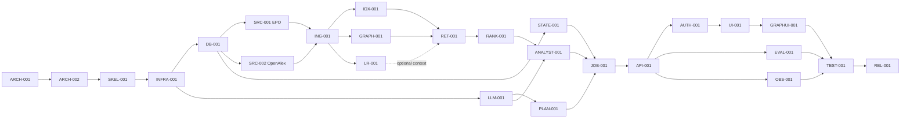

# План реализации

Статус документа: planning baseline от 2026-09-29. Здесь нет отметок «выполнено» для будущей реализации. После любой завершённой задачи обязателен отдельный commit и **успешный push** в `https://github.com/KulikovKA/Graph-based-RAG-for-article-analysis`; до проверки удалённого коммита статус остаётся «ожидает публикации». Это же правило изложено в [task.md](task.md).

## Шаблон задания агенту

«Выполни только задачу ID ниже. Прочитай указанные в её Context документы и сначала просмотри только указанные Files/references; проверь предположения по реальному коду выбранных версий. Сохрани существующие контракты, не делай посторонних рефакторингов. Добавь/обнови смысловые тесты и запусти их. Отчитайся: изменённые файлы, решения, выполненные проверки, оставшиеся риски. Отметь acceptance criteria и статус лишь после их выполнения. Проверь staged файлы на секреты/данные, сделай отдельный commit и push; проверь commit на GitHub. Если push не прошёл, оставь статус «ожидает публикации».»

Рекомендации моделей: **GPT-6 Astra / High** для архитектуры и критичных обзоров; **GPT-5.6 Sol / Medium или High** для обычной реализации и интеграции; **GPT-5.6 Luna / Instant или Medium** для узких конфигурационных/документационных задач. Это рекомендации, а не требование применять недоступную модель. Оценки времени — агентское время без длительной загрузки моделей/корпусов, review отдельно.

## Зависимости и параллельные ветви

После DB-001 параллельны EPO и OpenAlex; после ING-001 параллельны Qdrant, graph и LightRAG; после API-001 параллельны UI, eval и observability. Не запускать несколько задач, меняющих один контракт, без согласованного baseline.

## Сводка задач

| ID | Фаза | Priority | Model / thinking | Depends | Статус |
|---|---|---|---|---|---|
| ARCH-001 | 0 Доноры | P0 | Astra / High | — | готова |
| ARCH-002 | 0 Архитектурный review | P0 | Astra / High | ARCH-001 | ожидает |
| SKEL-001 | 1 Каркас | P0 | Sol / Medium | ARCH-002 | ожидает |
| INFRA-001 | 2 Инфраструктура | P0 | Sol / Medium | SKEL-001 | ожидает |
| DB-001 | 2 Данные | P0 | Sol / Medium | INFRA-001 | ожидает |
| SRC-001 | 3 EPO | P0 | Sol / High | DB-001 | ожидает |
| SRC-002 | 3 OpenAlex | P0 | Sol / Medium | DB-001 | ожидает |
| ING-001 | 3 Ingestion | P0 | Sol / High | SRC-001,SRC-002 | ожидает |
| IDX-001 | 4 Qdrant | P0 | Sol / Medium | ING-001 | ожидает |
| GRAPH-001 | 4 Neo4j | P0 | Sol / High | ING-001 | ожидает |
| LR-001 | 4 LightRAG | P1 | Sol / High | ING-001,ARCH-001 | ожидает |
| LLM-001 | 5 Inference | P0 | Sol / High | INFRA-001 | ожидает |
| PLAN-001 | 5 Planner | P0 | Sol / High | LLM-001,DB-001 | ожидает |
| STATE-001 | 8 Memory/cache | P0 | Sol / Medium | DB-001 | ожидает |
| RET-001 | 6 Retrieval | P0 | Sol / High | IDX-001,GRAPH-001 | ожидает |
| RANK-001 | 6 Reranking | P0 | Sol / Medium | RET-001 | ожидает |
| ANALYST-001 | 7 Analyst | P0 | Sol / High | RANK-001,LLM-001 | ожидает |
| JOB-001 | 8 Jobs | P0 | Sol / High | PLAN-001,STATE-001,ANALYST-001 | ожидает |
| API-001 | 9 API | P0 | Sol / Medium | JOB-001 | ожидает |
| AUTH-001 | 12 Multi-user/security | P0 | Sol / High | API-001 | ожидает |
| UI-001 | 10 Frontend | P0 | Sol / Medium | AUTH-001 | ожидает |
| GRAPHUI-001 | 11 Graph UI | P1 | Sol / Medium | UI-001,GRAPH-001 | ожидает |
| EVAL-001 | 13 Evaluation | P1 | Sol / High | API-001 | ожидает |
| OBS-001 | 14 Observability | P1 | Luna / Medium | API-001 | ожидает |
| TEST-001 | 14 Regression/security | P1 | Astra / High | GRAPHUI-001,EVAL-001,OBS-001,AUTH-001 | ожидает |
| REL-001 | 15 Release/demo | P1 | Sol / Medium | TEST-001 | ожидает |

Поскольку LR-001 имеет риск несовместимости, у RET-001 есть допустимый P0 fallback: отключаемый LightRAG adapter с пустым результатом. Фактическое подключение LightRAG остаётся P1; RET-001 не блокируется недоступностью донора Prior-Art-Engine. Graph UI и eval также P1: после P0 задач система уже отвечает через API и базовый чат.

## Детализация

### ARCH-001 — Проверить доноров и зафиксировать версии

- **Цель/зачем:** подтвердить фактические API, лицензии и границы reuse до написания интеграций; исключить архитектуру на вымышленных интерфейсах.
- **Depends / priority:** нет; P0. **Files:** docs/REPO_MAP.md, docs/DECISIONS.md, dependency lock/ADR. **References:** LightRAG paths в REPO_MAP, PQAI core/search.py/core/reranking.py/core/snippet.py, URL Prior-Art-Engine.
- **Сделать:** закрепить commit/tag LightRAG/PQAI; проверить `ainsert_custom_kg`, context-only query, source provenance, Neo4j/Qdrant config тестовым spike; повторно проверить 404 третьего репо и найти официальный доступный commit только если он существует; сверить LICENSE и transitive deps. Обновить карту и ADR-003/007.
- **Приёмка/тесты:** записаны проверенные версии, реальные сигнатуры и результаты минимального smoke; для недоступного кода явно указано «не проверено»; нет ссылок на несуществующие пути. **Не делать:** не форкать целые сервисы, не придумывать API.
- **Context:** только REPO_MAP, DECISIONS и перечисленные файлы доноров. **Модель:** Astra/High. **Размер:** L, 2–4 ч агента, 45 мин review. **Риск:** upstream drift/404.

### ARCH-002 — Независимая проверка planning package

- **Цель/зачем:** найти ложные предположения о донорах, противоречия между документами, циклы зависимостей, слишком крупные задачи и недостающие критерии до архитектурного freeze.
- **Depends / priority:** ARCH-001; P0. **Files:** docs/*.md, TASKS.md. **References:** pinned donor paths из REPO_MAP.md и результаты spike ARCH-001.
- **Сделать:** провести adversarial review отдельным рабочим проходом; проверить data/API/LLM/graph contracts друг против друга, модельные рекомендации и стоимость задач; исправить найденное и записать решения в DECISIONS.md. **Приёмка/тесты:** dependency graph без циклов, все P0 задачи достижимы, ссылки/версии действительны, противоречий по ownership, evidence IDs и статусам run нет; список замечаний и исправлений сохранён. **Не делать:** не перепроектировать систему без доказанного дефекта и не начинать production-код.
- **Context:** сначала ARCHITECTURE/REPO_MAP/TASKS, затем только документы, в которых обнаружен конфликт; не перечитывать доноров целиком. **Модель:** Astra/High. **Размер:** M, 1–2 ч, review 30 мин. **Риск:** непроверенная согласованность при изменении upstream.

### SKEL-001 — Каркас и контрактные границы

- **Цель/зачем:** создать Python package и frontend skeleton без бизнес-логики, чтобы имплементация шла по документированным границам.
- **Depends / priority:** ARCH-002; P0. **Files:** pyproject.toml, src/app/{api,domain,services,integrations,storage,workers}, frontend/, tests/, .env.example. **References:** docs/ARCHITECTURE.md, docs/API_CONTRACTS.md, docs/DECISIONS.md.
- **Сделать:** package layout, DI interfaces, lint/type/test commands, README для dev; закрепить версии и license inventory. **Приёмка/тесты:** пустое FastAPI приложение импортируется, frontend собирается, lint/typecheck проходят. **Не делать:** не создавать микросервисы и альтернативные RAG pipeline.
- **Context:** три названных docs и дерево проекта; доноров не перечитывать. **Модель:** Sol/Medium. **Размер:** M, 1–2 ч, review 20 мин. **Риск:** слишком тесные зависимости модулей.

### INFRA-001 — Compose и локальная сеть

- **Цель/зачем:** воспроизводимый запуск баз, прокси и worker на одном ПК.
- **Depends / priority:** SKEL-001; P0. **Files:** compose.yaml, docker/, Caddyfile, .env.example, docs/DEPLOYMENT.md. **References:** docs/DEPLOYMENT.md, docs/SECURITY.md.
- **Сделать:** сервисы и private network, health checks, volumes, limits из DEPLOYMENT, dev/prod profiles, контейнер миграций. **Приёмка/тесты:** `docker compose config` и запуск health; с хоста опубликован только Caddy. **Не делать:** не публиковать DB/inference порты, не добавлять Kubernetes/Kafka.
- **Context:** DEPLOYMENT/SECURITY и Docker files. **Модель:** Sol/Medium. **Размер:** M, 1–2 ч, review 30 мин. **Риск:** memory pressure Windows/Docker.

### DB-001 — Схема PostgreSQL и outbox

- **Цель/зачем:** обеспечить ownership, воспроизводимые версии идей и надёжное переиндексирование.
- **Depends / priority:** INFRA-001; P0. **Files:** src/app/storage/models.py, migrations/, src/app/storage/repositories.py, tests/integration/test_db.py. **References:** docs/DATA_MODEL.md, docs/MEMORY_AND_CACHE.md.
- **Сделать:** таблицы/индексы из DATA_MODEL, optimistic version update, transactional outbox, idempotent job lease. **Приёмка/тесты:** upgrade/downgrade миграций, concurrent version conflict, повторная постановка ingestion без дублей, чужой owner не читает запись. **Не делать:** не хранить идеи только в Redis.
- **Context:** DATA_MODEL/MEMORY_AND_CACHE и storage module. **Модель:** Sol/Medium. **Размер:** L, 2–3 ч, review 40 мин. **Риск:** миграция immutable run references.

### SRC-001 — Адаптер EPO OPS

- **Цель/зачем:** независимый от бизнес-логики источник патентов с точным provenance.
- **Depends / priority:** DB-001; P0. **Files:** src/app/integrations/epo.py, src/app/domain/source.py, tests/fixtures/epo/, tests/integration/test_epo.py. **References:** docs/REPO_MAP.md, [официальный OPS](https://www.epo.org/en/searching-for-patents/data/web-services/ops), [fair use](https://www.epo.org/en/service-support/ordering/fair-use).
- **Сделать:** OAuth credential handling, search/fetch, XML parsing, throttling headers, 429/retry/backoff, поля claims/description только где доступны, canonical patent IDs и source URLs. **Приёмка/тесты:** fixture XML нормализуется, missing field обозначен, quota/retry соблюдены, credentials не в логах. **Не делать:** не парсить Espacenet HTML, не распространять raw corpus.
- **Context:** REPO_MAP, DATA_MODEL и официальный OPS spec, только adapter code. **Модель:** Sol/High. **Размер:** L, 2–4 ч, review 45 мин. **Риск:** учёт/квоты EPO и неполный full text.

### SRC-002 — Адаптер OpenAlex

- **Цель/зачем:** второй независимый источник научных работ.
- **Depends / priority:** DB-001; P0. **Files:** src/app/integrations/openalex.py, src/app/domain/source.py, tests/fixtures/openalex/, tests/integration/test_openalex.py. **References:** docs/REPO_MAP.md, [OpenAlex developers](https://developers.openalex.org/).
- **Сделать:** search/fetch/pagination по текущему API, reconstruct abstract там, где доступен, authors/topics/references/citations, source URL, rate-limit/retry, nullable поля. **Приёмка/тесты:** fixtures с/без abstract, повторный fetch идемпотентен, ошибки 429/5xx управляемы. **Не делать:** не загружать полный OpenAlex snapshot на хост.
- **Context:** REPO_MAP, DATA_MODEL, API docs OpenAlex и adapter module. **Модель:** Sol/Medium. **Размер:** M, 1–2 ч, review 30 мин. **Риск:** API policy/schema drift.

### ING-001 — Нормализация и ingestion worker

- **Цель/зачем:** единый проверяемый документ и chunk для обоих источников.
- **Depends / priority:** SRC-001,SRC-002; P0. **Files:** src/app/services/ingestion.py, src/app/workers/ingest.py, src/app/domain/documents.py, tests/integration/test_ingestion.py. **References:** docs/DATA_MODEL.md, docs/ARCHITECTURE.md, adapters.
- **Сделать:** canonical IDs, language/section-aware chunking, content hashes, revision/outbox, повтор/частичный сбой, activation only after indexes confirmed. **Приёмка/тесты:** одинаковый payload не создаёт дубликаты, изменённый — новую ревизию, claims/abstract offsets и source links сохраняются, частичный сбой не публикует ревизию. **Не делать:** не отправлять полные документы в LLM.
- **Context:** DATA_MODEL/ARCHITECTURE и source/storage modules. **Модель:** Sol/High. **Размер:** L, 2–4 ч, review 45 мин. **Риск:** citation offset drift.

### IDX-001 — Qdrant индекс и embedding versioning

- **Цель/зачем:** быстрый поиск по snippets с контролем версии вектора.
- **Depends / priority:** ING-001; P0. **Files:** src/app/integrations/qdrant.py, src/app/services/indexing.py, tests/integration/test_qdrant.py. **References:** docs/ARCHITECTURE.md, docs/DATA_MODEL.md, LightRAG qdrant_impl.py только для compatibility check.
- **Сделать:** коллекции по model/dimension version, payload document/revision/chunk/source IDs, идемпотентный upsert/delete, metadata filters. **Приёмка/тесты:** reindex даёт тот же count, dimension mismatch отклоняется, inactive revisions не находятся. **Не делать:** не использовать shared collection без namespace.
- **Context:** ARCHITECTURE/DATA_MODEL и названные файлы. **Модель:** Sol/Medium. **Размер:** M, 1–2 ч, review 30 мин. **Риск:** смена embedding model.

### GRAPH-001 — Доменный Neo4j граф

- **Цель/зачем:** фиксированная патентная онтология с доказательными связями.
- **Depends / priority:** ING-001; P0. **Files:** src/app/integrations/neo4j.py, src/app/services/graph_index.py, migrations/neo4j/, tests/integration/test_graph.py. **References:** docs/GRAPH_SCHEMA.md, LightRAG neo4j_impl.py только для namespace проверки.
- **Сделать:** constraints/indexes, allowlist labels/edges, validated extraction с evidence IDs, upsert/remove revision provenance, bounded traversal. **Приёмка/тесты:** ни один LLM type вне enum не записан, все disclosure edges имеют provenance, 1-hop query bounded, ревизионное удаление корректно. **Не делать:** не писать приватные идеи в общий граф, не принимать raw Cypher от клиента.
- **Context:** GRAPH_SCHEMA/DATA_MODEL и graph modules. **Модель:** Sol/High. **Размер:** L, 2–4 ч, review 45 мин. **Риск:** entity identity/provenance.

### LR-001 — LightRAG adapter (отключаемый)

- **Цель/зачем:** добавить Graph-RAG контекст без зависимости всего продукта от внутренностей LightRAG.
- **Depends / priority:** ING-001,ARCH-001; P1. **Files:** src/app/integrations/lightrag_adapter.py, tests/integration/test_lightrag.py, dependency lock. **References:** docs/REPO_MAP.md, pinned LightRAG lightrag.py/base.py, examples/insert_custom_kg.py.
- **Сделать:** isolated workspace/collections, validated custom KG или документированный fallback, context-only query, source ID mapping, timeouts/failure isolation. **Приёмка/тесты:** smoke insert/query выдаёт существующие evidence IDs; при выключенном adapter основной retrieval работает; обновление ревизии не цитирует старый chunk. **Не делать:** не использовать LightRAG auth/WebUI/final answer, не копировать репозиторий целиком.
- **Context:** REPO_MAP, ARCHITECTURE и только указанные upstream paths. **Модель:** Sol/High. **Размер:** L, 2–4 ч, review 45 мин. **Риск:** upstream API/provenance compatibility.

### LLM-001 — InferenceProvider и CPU queue

- **Цель/зачем:** отделить модель от бизнес-логики и ограничить RAM/конкуренцию.
- **Depends / priority:** INFRA-001; P0. **Files:** src/app/domain/inference.py, src/app/integrations/inference_http.py, src/app/workers/inference.py, tests/contract/test_inference.py. **References:** docs/LLM_CONTRACTS.md, docs/DEPLOYMENT.md.
- **Сделать:** `complete_json`/`stream_text`/`embed`/`rerank`, timeout/cancel/usage/TTFT, config моделей, один concurrent generation и bounded queue; CPU smoke на выбранных весах. **Приёмка/тесты:** fake provider проходит contract tests, timeout/cancel не оставляет active lease, API endpoint можно заменить на remote GPU настройкой. **Не делать:** не хардкодить Ollama URL/модель в domain, не публиковать inference порт.
- **Context:** LLM_CONTRACTS/DEPLOYMENT и inference files. **Модель:** Sol/High. **Размер:** L, 2–3 ч, review 35 мин. **Риск:** CPU latency/память.

### PLAN-001 — Intent planner и versioned patch

- **Цель/зачем:** различать новую идею, изменение признака и вопрос к существующему evidence.
- **Depends / priority:** LLM-001,DB-001; P0. **Files:** src/app/domain/planner.py, src/app/services/idea_state.py, prompts/planner_v1.txt, tests/unit/test_planner.py. **References:** docs/LLM_CONTRACTS.md, docs/DATA_MODEL.md.
- **Сделать:** строгая Pydantic schema, validation/retry/fallback, patch по feature IDs с expected version; deterministic requires_retrieval по state/index/config hash. **Приёмка/тесты:** сценарии OCR→barcode, объяснение второго патента без повторного retrieval, invalid ID/version conflict, malformed JSON. **Не делать:** не доверять `suggested_retrieval` без shell проверки.
- **Context:** LLM_CONTRACTS/DATA_MODEL и planner/state modules. **Модель:** Sol/High. **Размер:** L, 2–3 ч, review 40 мин. **Риск:** неверный patch изменяет смысл идеи.

### STATE-001 — Память, кеш и изоляция

- **Цель/зачем:** durable разговор и безопасный повторный доступ к evidence.
- **Depends / priority:** DB-001; P0. **Files:** src/app/services/conversations.py, src/app/integrations/redis_cache.py, tests/integration/test_memory.py. **References:** docs/MEMORY_AND_CACHE.md, docs/DATA_MODEL.md, docs/SECURITY.md.
- **Сделать:** CRUD conversation/messages/versions, summary как derivation, cache keys/TTL/versioning, owner-scoped read, Redis failure fallback. **Приёмка/тесты:** две сессии не видят данные друг друга; потеря Redis не теряет состояние; старый run воспроизводит старую версию идеи/evidence. **Не делать:** не хранить transcript/idea только в Redis, не кешировать по тексту без user scope.
- **Context:** три названных docs и conversation/cache files. **Модель:** Sol/Medium. **Размер:** M, 1–2 ч, review 30 мин. **Риск:** cache cross-user leak.

### RET-001 — Candidate retrieval и fusion

- **Цель/зачем:** получить ограниченный набор патентов/работ без дорогой генерации.
- **Depends / priority:** IDX-001,GRAPH-001; P0. LR-001 опционален и не блокирует P0. **Files:** src/app/services/retrieval.py, src/app/domain/evidence.py, tests/integration/test_retrieval.py. **References:** docs/ARCHITECTURE.md, docs/GRAPH_SCHEMA.md, docs/REPO_MAP.md; PQAI core/search.py как reference.
- **Сделать:** query construction из идеи, параллельные vector/metadata/graph кандидаты, optional LightRAG context, canonical dedup, bounded pool, score normalization, partial-source status. **Приёмка/тесты:** top IDs стабильны на fixture corpus, дубликаты слиты, отсутствие канала явно отражено, чужой/private evidence не попадает. **Не делать:** не отправлять десятки целых патентов analyst, не вызывать LLM-as-judge.
- **Context:** ARCHITECTURE/GRAPH_SCHEMA/REPO_MAP и retrieval/index adapters. **Модель:** Sol/High. **Размер:** L, 2–4 ч, review 45 мин. **Риск:** score calibration и неполный корпус.

### RANK-001 — Лёгкий reranker и evidence pack

- **Цель/зачем:** сузить кандидатов до объяснимых фрагментов под token budget.
- **Depends / priority:** RET-001; P0. **Files:** src/app/services/rerank.py, src/app/services/evidence_pack.py, tests/unit/test_evidence_pack.py. **References:** docs/LLM_CONTRACTS.md, PQAI core/reranking.py/core/snippet.py, LightRAG lightrag/rerank.py.
- **Сделать:** CPU benchmark двух компактных вариантов на размеченной мини-выборке, выбрать один; section-aware snippets с offsets, diversity, top 10–15 docs, budget enforcement. **Приёмка/тесты:** все pack IDs существуют, spans совпадают с revision, pack не превышает configured tokens, deterministic tie-break. **Не делать:** не копировать случайные snippet окна PQAI, не исполнять HTML из источника.
- **Context:** LLM_CONTRACTS/EVALUATION, названные upstream files и rerank modules. **Модель:** Sol/Medium. **Размер:** M, 1–2 ч, review 30 мин. **Риск:** слабое качество CPU reranker.

### ANALYST-001 — Доказательный анализ Smart Qwen

- **Цель/зачем:** получить сравнение признаков и вывод в пределах evidence pack.
- **Depends / priority:** RANK-001,LLM-001; P0. **Files:** src/app/services/analyst.py, prompts/analyst_v1.txt, tests/unit/test_analyst.py. **References:** docs/LLM_CONTRACTS.md, docs/API_CONTRACTS.md, docs/EVALUATION.md.
- **Сделать:** typed input/output, source citation validator, uncertainty/coverage handling, one retry, deterministic fallback; логировать версии и token counts. **Приёмка/тесты:** несуществующий evidence ID отвергнут; partial corpus помечен; ответ не объявляет юридическую новизну; long evidence урезается budget. **Не делать:** не принимать свободный текст модели как финальный без проверки ссылок.
- **Context:** три названных docs и analyst/evidence/provider modules. **Модель:** Sol/High. **Размер:** L, 2–3 ч, review 45 мин. **Риск:** галлюцинации с внешне валидными ссылками.

### JOB-001 — Оркестрация analysis jobs и SSE events

- **Цель/зачем:** выдержать долгую CPU генерацию, отмену и повторное подключение клиента.
- **Depends / priority:** PLAN-001,STATE-001,ANALYST-001; P0. **Files:** src/app/services/analysis_run.py, src/app/workers/analysis.py, src/app/storage/jobs.py, tests/integration/test_jobs.py. **References:** docs/ARCHITECTURE.md, docs/API_CONTRACTS.md, docs/DATA_MODEL.md.
- **Сделать:** state machine pending/running/completed/failed/cancelled, idempotency key, leases/retry, run_events sequence, replay, one-worker concurrency, stage timings. **Приёмка/тесты:** crash/restart не теряет run, duplicate request не удваивает работу, cancel останавливает следующие стадии, replay доставляет terminal event. **Не делать:** не полагаться на Redis pub/sub как durable queue.
- **Context:** ARCHITECTURE/API_CONTRACTS/DATA_MODEL и job modules. **Модель:** Sol/High. **Размер:** L, 2–4 ч, review 45 мин. **Риск:** двойная генерация после lease expiry.

### API-001 — FastAPI v1 и поток ответов

- **Цель/зачем:** реализовать стабильный frontend/backend контракт.
- **Depends / priority:** JOB-001; P0. **Files:** src/app/api/routes/{conversations,runs,sources,health}.py, src/app/api/schemas.py, tests/contract/test_api.py. **References:** docs/API_CONTRACTS.md, docs/SECURITY.md.
- **Сделать:** endpoints из контракта, Pydantic validation, SSE с Last-Event-ID, error mapping, OpenAPI snapshot, request ID. **Приёмка/тесты:** contract tests для 202/409/413/429/503, SSE reconnect, ownership check before cache/graph. **Не делать:** не отдавать internal graph dump, stack trace или raw model output.
- **Context:** API_CONTRACTS/SECURITY и только api/service interfaces. **Модель:** Sol/Medium. **Размер:** L, 2–3 ч, review 40 мин. **Риск:** расхождение OpenAPI/UI.

### AUTH-001 — Пользователи и внешняя безопасность

- **Цель/зачем:** подготовить несколько пользователей и безопасный LAN/внешний demo.
- **Depends / priority:** API-001; P0. **Files:** src/app/api/auth.py, src/app/services/auth.py, Caddyfile, tests/security/test_isolation.py. **References:** docs/SECURITY.md, docs/API_CONTRACTS.md, docs/DEPLOYMENT.md.
- **Сделать:** session auth, password hash/OIDC adapter, CSRF/CORS, rate limiting, input limits, IDOR tests, source URL allowlist; только Caddy exposed. **Приёмка/тесты:** другой пользователь получает 404/403 для conversation/run/graph, CSRF блокируется, TLS/exposed ports проверены. **Не делать:** не выставлять базы/LLM наружу, не делать global mutable user state.
- **Context:** SECURITY/API_CONTRACTS/DEPLOYMENT и auth/routes. **Модель:** Sol/High. **Размер:** L, 2–4 ч, review 60 мин. **Риск:** cross-user leak.

### UI-001 — Адаптивный чат и источники

- **Цель/зачем:** дать работающий desktop/mobile интерфейс для идеи, ответа и первоисточников.
- **Depends / priority:** AUTH-001; P0. **Files:** frontend/src/{api,features/chat,features/sources,components}, frontend/tests/. **References:** docs/API_CONTRACTS.md, docs/ARCHITECTURE.md.
- **Сделать:** login, conversations, chat, idea version indicator, SSE statuses/answer, citation source cards, partial coverage notice, responsive layout. **Приёмка/тесты:** сценарий с новым запросом и follow-up на мобильной ширине; клики по evidence ведут к карточке и внешнему source URL; reconnect работает. **Не делать:** не рендерить raw HTML модели, не делать тяжёлый SSR runtime.
- **Context:** API_CONTRACTS/ARCHITECTURE и frontend source. **Модель:** Sol/Medium. **Размер:** L, 2–4 ч, review 40 мин. **Риск:** mobile UX/stream state.

### GRAPHUI-001 — Объясняющий интерактивный граф

- **Цель/зачем:** дать понятную карту текущего анализа без показа полного внутреннего графа.
- **Depends / priority:** UI-001,GRAPH-001; P1. **Files:** frontend/src/features/graph/, src/app/api/routes/graph.py, tests/contract/test_graph_api.py. **References:** docs/GRAPH_SCHEMA.md, docs/API_CONTRACTS.md, LightRAG GraphViewer.tsx как reference.
- **Сделать:** bounded graph DTO, zoom/pan/click/details/source/highlight path/lazy expand-collapse; mobile list fallback. **Приёмка/тесты:** начальный ≤30 узлов/50 рёбер, expand ≤20 узлов, other user's run недоступен, узел связывается с evidence card. **Не делать:** не давать Cypher/browser прямой доступ к Neo4j, не строить 3D граф.
- **Context:** GRAPH_SCHEMA/API_CONTRACTS, graph UI/routes и указанный upstream viewer. **Модель:** Sol/Medium. **Размер:** M, 1–2 ч, review 35 мин. **Риск:** перегрузка UI/разглашение данных.

### EVAL-001 — 100-case offline harness

- **Цель/зачем:** измерять регрессии качества и цитат между версиями.
- **Depends / priority:** API-001; P1. **Files:** eval/cases/, eval/run.py, eval/judge.py, eval/report.py, tests/eval/. **References:** docs/EVALUATION.md, docs/LLM_CONTRACTS.md.
- **Сделать:** case schema и ~100 обезличенных запросов, frozen corpus/index, run artifact versions, structured judge, сравнение baseline, HTML/Markdown report. **Приёмка/тесты:** повторный запуск по одному snapshot воспроизводит input metadata; 100% citation IDs валидны; отчёт показывает per-case diff и пороги. **Не делать:** не включать judge в production path, не сравнивать отдельные RAG архитектуры как цель.
- **Context:** EVALUATION/LLM_CONTRACTS и eval modules. **Модель:** Sol/High. **Размер:** L, 3–5 ч, review 45 мин. **Риск:** bias judge/разметки.

### OBS-001 — Логи, метрики, health

- **Цель/зачем:** диагностировать latency и сбои без утечки идей/секретов.
- **Depends / priority:** API-001; P1. **Files:** src/app/observability/, src/app/api/routes/health.py, tests/unit/test_logging.py. **References:** docs/ARCHITECTURE.md, docs/SECURITY.md.
- **Сделать:** structured request/run stage logs, TTFT/token/cache metrics, liveness/readiness, redaction и retention. **Приёмка/тесты:** simulated error сохраняет IDs и stage code, но не prompt/cookie/key; readiness различает critical/degraded. **Не делать:** не добавлять большой monitoring stack без измеренной необходимости.
- **Context:** ARCHITECTURE/SECURITY и observability/health modules. **Модель:** Luna/Medium. **Размер:** S, 0.5–1 ч, review 20 мин. **Риск:** PII в логах.

### TEST-001 — Сквозная проверка и adversarial review

- **Цель/зачем:** проверить согласованность системы на реальном Compose и враждебных входах.
- **Depends / priority:** GRAPHUI-001,EVAL-001,OBS-001,AUTH-001; P1. **Files:** tests/e2e/, tests/security/, docs/DECISIONS.md, TASKS.md. **References:** все docs по конкретным найденным дефектам, отчёт eval.
- **Сделать:** clean install + EPO/OpenAlex fixtures, follow-up C→D, question about saved second source, SSE reconnect, crash/retry, IDOR/SSRF/prompt injection, backup restore, 100-case regression; исправить найденные противоречия. **Приёмка/тесты:** все critical tests зелёные, citation validity 100%, открытых critical security defects нет, все docs соответствуют факту. **Не делать:** не перепроектировать без подтверждённого дефекта.
- **Context:** сначала test reports, затем только связанные docs/modules. **Модель:** Astra/High. **Размер:** L, 3–5 ч, review 60 мин. **Риск:** скрытые интеграционные несовместимости.

### REL-001 — MVP demo/release

- **Цель/зачем:** воспроизводимый релиз на одном ПК и доступ с телефона/LAN.
- **Depends / priority:** TEST-001; P1. **Files:** README.md, docs/DEPLOYMENT.md, compose.yaml, release notes. **References:** docs/DEPLOYMENT.md, docs/SECURITY.md, docs/EVALUATION.md.
- **Сделать:** pin images/models, smoke script, backup/restore runbook, LAN demo, HTTPS external checklist, release tag после зелёных gates. **Приёмка/тесты:** clean host инструкциями поднимает сервисы; новый пользователь выполняет запрос и видит citations/graph; restore проверен; GitHub tag указывает на опубликованный commit. **Не делать:** не публиковать secrets/model weights/corpora и инфраструктурные порты.
- **Context:** три названных docs, release/compose files. **Модель:** Sol/Medium. **Размер:** M, 1–2 ч, review 40 мин. **Риск:** различия Windows Docker host.

## Milestones

| Milestone | После | Проверяемое демо |
|---|---|---|
| M0 architecture frozen | ARCH-002 | pinned donor versions, независимый review, согласованные docs/ADR; 404 донор явно отмечен |
| M1 infrastructure boots | DB-001 | Compose health + migrations, извне виден только Caddy |
| M2 documents ingested | ING-001 | EPO+OpenAlex fixture → document revision + chunks |
| M3 retrieval works | RANK-001 | идея → top documents, snippets и evidence IDs |
| M4 CLI/API answer | API-001 | CLI/API run с валидированными citation IDs |
| M5 conversation memory | API-001 | C→D создаёт новую версию; вопрос об источнике reuse evidence |
| M6 web UI | UI-001 | мобильный чат и карточки источников |
| M7 interactive graph | GRAPHUI-001 | раскрытие одного hop без утечки чужих данных |
| M8 multi-user external demo | AUTH-001 + REL-001 | два пользователя, HTTPS, изоляция и rate limit |
| M9 100-query evaluation | EVAL-001 | отчёт по 100 кейсам и baseline diff |
| M10 MVP release candidate | TEST-001 + REL-001 | clean install, restore, eval/security gates |

**Критический путь:** ARCH-001→ARCH-002→SKEL→INFRA→DB→SRC→ING→IDX/GRAPH→RET→RANK→ANALYST→JOB→API→AUTH→UI→GRAPHUI→TEST→REL. Длиннейшие риски: EPO доступ/квоты, LightRAG compatibility, CPU latency, качество evidence/citations. Сумма оценок ~47–67 ч агентской работы плюс 10–15 ч review, без скачивания корпуса и ожидания внешних аккаунтов. Astra escalation: ARCH-001, ARCH-002, TEST-001 и только системные дефекты без ясной причины. P0 после UI-001 даёт функциональный MVP; P1 дополняет graph UI, evaluation и release hardening. P2 задачи фиксировать позже на основании измерений, не прятать их в P0.
