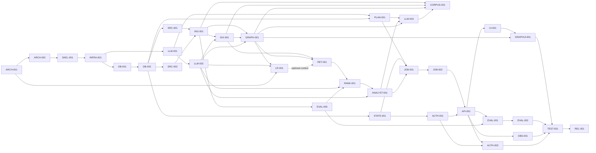

# План реализации

Статус документа: planning baseline от 2026-09-29. Здесь нет отметок «выполнено» для будущей реализации. После любой завершённой задачи обязателен отдельный commit и **успешный push** в `https://github.com/KulikovKA/Graph-based-RAG-for-article-analysis`; до проверки удалённого коммита статус остаётся «ожидает публикации». Это же правило изложено в [task.md](task.md).

Изменение baseline 2026-09-29: [ADR-011](docs/DECISIONS.md#adr-011--reasoning-analyst-и-validated-streaming-2026-09-29-accepted-planning), [adversarial review](docs/REASONING_STREAMING_REVIEW.md). Выбран AnalysisV1 → deterministic AnswerV1/public summary → atomic commit → SSE. Analyst заменён на `gemma4:26b-a4b-it-mtp-q4_K_M`; повторные LLM-002, RANK-001 и ANALYST-001 завершены 2026-09-30. GPT-OSS результаты сохранены как исторические. Дополнения ADR-011 нормативны для будущей реализации. DB-001/002 остаются исторически завершёнными; следующая миграция projections и atomic publication входят в JOB-002. План дополнен gate LLM-003 → CORPUS-001; фактический выбор production-моделей предстоит LLM-003.

## Шаблон задания агенту

«Выполни только задачу ID ниже. Прочитай указанные в её Context документы и сначала просмотри только указанные Files/references; проверь предположения по реальному коду выбранных версий. Сохрани существующие контракты, не делай посторонних рефакторингов. Добавь/обнови смысловые тесты и запусти их. Отчитайся: изменённые файлы, решения, выполненные проверки, оставшиеся риски. Отметь acceptance criteria и статус лишь после их выполнения. Проверь staged файлы на секреты/данные, сделай отдельный commit и push; проверь commit на GitHub. Если push не прошёл, оставь статус «ожидает публикации».»

Рекомендации моделей: **GPT-6 Astra / High** для архитектуры и критичных обзоров; **GPT-5.6 Sol / Medium или High** для обычной реализации и интеграции; **GPT-5.6 Luna / Low или Medium** для узких конфигурационных/документационных задач. Это предпочтения из исходного задания, а не требование применять недоступную модель. Instant не задаётся как reasoning effort: использовать поддерживаемый Low. При отсутствии нужного семейства выбрать доступный аналог и записать замену; автоматическая смена модели этим планом не выполняется. См. проверку официальных источников в [ARCH_REVIEW](docs/ARCH_REVIEW.md#модели-и-стоимость). Оценки времени — агентское время без длительной загрузки моделей/корпусов, review отдельно.

## Зависимости и параллельные ветви

После DB-002 параллельны source adapters и STATE/AUTH; LLM-001/002 идут от INFRA независимо. IDX ждёт ING и CPU gate, GRAPH затем закрывает активацию двух индексов. LLM-003 сравнивает три production-роли после PLAN-001, ANALYST-001 и GRAPH-001; LLM-002 и EVAL-000 уже входят в их транзитивные зависимости. CORPUS-001 начинает массовую индексацию только после LLM-003 и готовых ING/IDX/GRAPH. После API параллельны UI, EVAL, OBS и внешний AUTH-002. EVAL-001 использует frozen EVAL-000 fixture, EVAL-002 — собственный размеченный snapshot, TEST-001 — fixtures и baseline EVAL-002; массовый backfill не является их входным условием. Не запускать задачи, меняющие общий контракт, без согласованного baseline.

## Сводка задач

| ID | Фаза | Priority | Model / thinking | Depends | Статус |
|---|---|---|---|---|---|
| ARCH-001 | 0 Доноры | P0 | Astra / High | — | выполнена |
| ARCH-002 | 0 Архитектурный review | P0 | Astra / High | ARCH-001 | выполнена |
| SKEL-001 | 1 Каркас | P0 | Sol / Medium | ARCH-002 | выполнена |
| INFRA-001 | 2 Инфраструктура | P0 | Sol / Medium | SKEL-001 | выполнена |
| DB-001 | 2 Данные | P0 | Sol / Medium | INFRA-001 | выполнена |
| DB-002 | Репозитории, outbox и lease primitives | P0 | Sol / High | DB-001 | выполнена |
| SRC-001 | 3 EPO | P0 | Sol / High | DB-002 | выполнена |
| SRC-002 | 3 OpenAlex | P0 | Sol / Medium | DB-002 | выполнена |
| ING-001 | 3 Ingestion | P0 | Sol / High | SRC-001,SRC-002 | выполнена |
| EVAL-000 | Мини-набор для разработки retrieval | P0 | Sol / Medium | ING-001 | выполнена |
| IDX-001 | 4 Qdrant | P0 | Sol / Medium | ING-001,LLM-002 | выполнена |
| GRAPH-001 | 4 Neo4j | P0 | Sol / High | ING-001,IDX-001,LLM-002 | выполнена |
| GRAPH-002 | Canonicalization / entity resolution shadow experiment | P1 | Sol / High | GRAPH-001,LLM-002,CORPUS-001 | выполнена |
| LR-001 | 4 LightRAG | P1 | Sol / High | GRAPH-001,LLM-002,ARCH-001 | выполнена |
| LLM-001 | 5 Inference | P0 | Sol / High | INFRA-001 | выполнена |
| LLM-002 | Выбор локальных весов и CPU smoke | P0 | Sol / High | LLM-001 | выполнена |
| LLM-003 | Сравнение inference-конфигураций и выбор production-моделей | P0 | Sol / High | PLAN-001,ANALYST-001,GRAPH-001 | выполнена |
| LLM-005 | Relation classifier для Analyst и условный redesign pipeline | P0 | Sol / High | LLM-004,ANALYST-001 | выполнена |
| CORPUS-001 | Initial corpus backfill EPO/OpenAlex | P0 | Sol / High | ING-001,IDX-001,GRAPH-001,LLM-003 | в работе |
| PLAN-001 | 5 Planner | P0 | Sol / High | LLM-001,DB-002 | выполнена |
| STATE-001 | 8 Memory/cache | P0 | Sol / Medium | DB-002 | выполнена |
| RET-001 | 6 Retrieval | P0 | Sol / High | IDX-001,GRAPH-001 | выполнена |
| RANK-001 | 6 Reranking | P0 | Sol / Medium | RET-001,LLM-002,EVAL-000 | выполнена |
| ANALYST-001 | 7 Analyst | P0 | Sol / High | RANK-001,LLM-002 | выполнена |
| JOB-001 | 8 Jobs | P0 | Sol / High | PLAN-001,STATE-001,ANALYST-001 | выполнена |
| JOB-002 | Проверенная публикация результата и SSE replay | P0 | Sol / High | JOB-001 | выполнена |
| AUTH-001 | 12 Multi-user/security | P0 | Sol / High | STATE-001 | ожидает публикации |
| API-001 | 9 API | P0 | Sol / Medium | JOB-002,AUTH-001 | ожидает |
| AUTH-002 | Внешний доступ и проверка периметра | P1 | Sol / High | API-001,AUTH-001 | ожидает |
| UI-001 | 10 Frontend | P0 | Sol / Medium | API-001 | ожидает |
| GRAPHUI-001 | 11 Graph UI | P1 | Sol / Medium | UI-001,GRAPH-001 | ожидает |
| EVAL-001 | 13 Evaluation | P1 | Sol / High | API-001,EVAL-000 | ожидает |
| EVAL-002 | 100 случаев и baseline evaluation | P1 | Sol / Medium | EVAL-001 | ожидает |
| OBS-001 | 14 Observability | P1 | Luna / Medium | API-001 | ожидает |
| TEST-001 | 14 Regression/security | P1 | Astra / High | GRAPHUI-001,EVAL-002,OBS-001,AUTH-002 | ожидает |
| REL-001 | 15 Release/demo | P1 | Sol / Medium | TEST-001 | ожидает |

Поскольку LR-001 имеет риск несовместимости, у RET-001 есть допустимый P0 fallback: отключаемый LightRAG adapter с пустым результатом. Фактическое подключение LightRAG остаётся P1; RET-001 использует PriorArtRAG только как pinned reference patterns и не зависит от его runtime. Graph UI и eval также P1: после P0 задач система уже отвечает через API и базовый чат.

## Детализация

### ARCH-001 — Проверить доноров и зафиксировать версии

- **Результат (2026-09-29):** [отчёт и воспроизведение](docs/validation/ARCH-001/README.md), [donor lock](docs/donors.lock.json), [фактический smoke JSON](docs/validation/ARCH-001/result.json). Реальные Neo4j/Qdrant, 6 успешных проверок и 3 подтверждённых ограничения provenance. ADR-003/007 уточнены; LightRAG ограничен дополнительным публичным контекстом с проверкой evidence в нашем хранилище. Публикация — отдельный коммит ARCH-001, обязательный push и сверка удалённой ветки по `task.md`.
- **Цель/зачем:** подтвердить фактические API, лицензии и границы reuse до написания интеграций; исключить архитектуру на вымышленных интерфейсах.
- **Depends / priority:** нет; P0. **Files:** docs/REPO_MAP.md, docs/DECISIONS.md, dependency lock/ADR. **References:** LightRAG [lightrag/base.py](https://github.com/HKUDS/LightRAG/blob/453dce83d6d0354a06e46c8d4029a0895c4e054b/lightrag/base.py), [lightrag/lightrag.py](https://github.com/HKUDS/LightRAG/blob/453dce83d6d0354a06e46c8d4029a0895c4e054b/lightrag/lightrag.py), [examples/insert_custom_kg.py](https://github.com/HKUDS/LightRAG/blob/453dce83d6d0354a06e46c8d4029a0895c4e054b/examples/insert_custom_kg.py); PQAI [core/search.py](https://github.com/pqaidevteam/pqai/blob/56342aaac5d9bf626f9413e5e49819e70709ce2f/core/search.py), [core/reranking.py](https://github.com/pqaidevteam/pqai/blob/56342aaac5d9bf626f9413e5e49819e70709ce2f/core/reranking.py), [core/snippet.py](https://github.com/pqaidevteam/pqai/blob/56342aaac5d9bf626f9413e5e49819e70709ce2f/core/snippet.py); PriorArtRAG pinned files [decompose.py](https://github.com/ABHIJEET-MUNESHWAR/PriorArtRAG/blob/fcaad8482c7df5d8106d4041c45d732f18d8c295/priorartrag/domain/decompose.py), [pipeline.py](https://github.com/ABHIJEET-MUNESHWAR/PriorArtRAG/blob/fcaad8482c7df5d8106d4041c45d732f18d8c295/priorartrag/domain/pipeline.py), [fusion.py](https://github.com/ABHIJEET-MUNESHWAR/PriorArtRAG/blob/fcaad8482c7df5d8106d4041c45d732f18d8c295/priorartrag/domain/fusion.py), [rerank.py](https://github.com/ABHIJEET-MUNESHWAR/PriorArtRAG/blob/fcaad8482c7df5d8106d4041c45d732f18d8c295/priorartrag/domain/rerank.py), [grounding.py](https://github.com/ABHIJEET-MUNESHWAR/PriorArtRAG/blob/fcaad8482c7df5d8106d4041c45d732f18d8c295/priorartrag/domain/grounding.py), [generator.py](https://github.com/ABHIJEET-MUNESHWAR/PriorArtRAG/blob/fcaad8482c7df5d8106d4041c45d732f18d8c295/priorartrag/adapters/llm/generator.py), [ports.py](https://github.com/ABHIJEET-MUNESHWAR/PriorArtRAG/blob/fcaad8482c7df5d8106d4041c45d732f18d8c295/priorartrag/app/ports.py), [EVALUATION.md](https://github.com/ABHIJEET-MUNESHWAR/PriorArtRAG/blob/fcaad8482c7df5d8106d4041c45d732f18d8c295/EVALUATION.md); mcp-prior-art [epo.py](https://github.com/chasewhughes/mcp-prior-art/blob/eae73ff170b058772ca74e97b13eade853420e83/src/mcp_prior_art/apis/epo.py) as optional source adapter reference.
- **Сделать:** pin LightRAG and PQAI commit/tag and PriorArtRAG SHA `fcaad8482c7df5d8106d4041c45d732f18d8c295`; verify all linked files and licenses; check `ainsert_custom_kg`, context-only query, source provenance, Neo4j/Qdrant config in a minimal LightRAG smoke; review PriorArtRAG decomposition/fusion/grounding contracts; compare EPO adapter reference with official OPS/fair-use docs. Update REPO_MAP and ADR-003/007.
- **Приёмка/тесты:** pinned IDs and file links resolve, MIT notices confirmed, minimal LightRAG smoke records actual result, and only reusable patterns/risks are documented. **Не делать:** не искать replacement PriorArtRAG, не importировать его service architecture, не форкать целые сервисы, не придумывать API.
- **Context:** REPO_MAP, DECISIONS and only linked upstream files/docs. **Модель:** Astra/High. **Размер:** L, 2–4 ч агента, 45 мин review. **Риск:** upstream drift and integration incompatibility.

### ARCH-002 — Независимая проверка planning package

- **Результат (2026-09-29):** [14 замечаний, исправления и сверка контрактов](docs/ARCH_REVIEW.md), [автоматическая проверка](docs/validation/ARCH-002/result.json). 32 задачи / 51 зависимость, DAG без циклов, 24 P0 без P1 prerequisites; четыре donor commit/tree и 35 SHA-256 подтверждены. ADR-008–010 фиксируют решения; production-код не начат. Опубликовано в коммите d06c8d88aff7555ac0b1cea46284884562a9b392; push успешен, local HEAD и refs/heads/main сверены по task.md.
- **Цель/зачем:** найти ложные предположения о донорах, противоречия между документами, циклы зависимостей, слишком крупные задачи и недостающие критерии до архитектурного freeze.
- **Depends / priority:** ARCH-001; P0. **Files:** docs/*.md, TASKS.md. **References:** pinned donor paths из REPO_MAP.md и результаты spike ARCH-001.
- **Сделать:** провести adversarial review отдельным рабочим проходом; проверить data/API/LLM/graph contracts друг против друга, модельные рекомендации и стоимость задач; исправить найденное и записать решения в DECISIONS.md. **Приёмка/тесты:** dependency graph без циклов, все P0 задачи достижимы, ссылки/версии действительны, противоречий по ownership, evidence IDs и статусам run нет; список замечаний и исправлений сохранён. **Не делать:** не перепроектировать систему без доказанного дефекта и не начинать production-код.
- **Context:** сначала ARCHITECTURE/REPO_MAP/TASKS, затем только документы, в которых обнаружен конфликт; не перечитывать доноров целиком. **Модель:** Astra/High. **Размер:** M, 1–2 ч, review 30 мин. **Риск:** непроверенная согласованность при изменении upstream.

### SKEL-001 — Каркас и контрактные границы

- **Результат (2026-09-29):** создан Python package `src/app` с FastAPI factory, базовыми RunV1/AnswerV1/EvidenceV1 DTO, DI ports, health/redaction scaffold; добавлен React/TypeScript/Vite skeleton, команды разработки, `.env.example`, lock-файлы и license inventory. Проверки: pytest (3), Ruff, mypy, compileall, frontend build/typecheck/ESLint; npm audit — 0 vulnerabilities. Опубликовано в коммите `79c762f69065dd3e72a7059d175a306f15ebc89a`, наличие в `origin/main` сверено.
- **Цель/зачем:** создать Python package и frontend skeleton без бизнес-логики, чтобы имплементация шла по документированным границам.
- **Depends / priority:** ARCH-002; P0. **Files:** pyproject.toml, src/app/{api,domain,services,integrations,storage,workers}, frontend/, tests/, .env.example. **References:** docs/ARCHITECTURE.md, docs/API_CONTRACTS.md, docs/DECISIONS.md.
- **Сделать:** package layout, DI interfaces, lint/type/test commands, README для dev; закрепить версии и license inventory. **Приёмка/тесты:** пустое FastAPI приложение импортируется, frontend собирается, lint/typecheck проходят. **Не делать:** не создавать микросервисы и альтернативные RAG pipeline.
- **Context:** три названных docs и дерево проекта; доноров не перечитывать. **Модель:** Sol/Medium. **Размер:** M, 1–2 ч, review 20 мин. **Риск:** слишком тесные зависимости модулей.
- **Уточнение ARCH-002:** Зафиксировать общие RunV1/AnswerV1/evidence interfaces из API/LLM; health и redaction scaffold включены сразу.

### INFRA-001 — Compose и локальная сеть

- **Результат (2026-09-29):** добавлен Compose bootstrap с API, worker, PostgreSQL, Redis, Neo4j, Qdrant, миграционным stub и профилями Caddy `dev`/`prod` плюс необязательным Ollama `cpu`. Базы закрыты internal network без host ports; только Caddy публикует loopback. Образы закреплены версиями, healthchecks/volumes/memory limits настроены. Проверены `docker compose config` и все профили, образы собраны; все семь сервисов поднялись healthy; Caddy `/health/live` → 200, `/health/ready` → 503 до DB-001/002; host port audit подтвердил только Caddy. Опубликовано в коммите `03e0d9b2f7de271d0a4c8cbd9ac1237c039a5971`, наличие в `origin/main` сверено.
- **Цель/зачем:** воспроизводимый запуск баз, прокси и worker на одном ПК.
- **Depends / priority:** SKEL-001; P0. **Files:** compose.yaml, docker/, Caddyfile, .env.example, docs/DEPLOYMENT.md. **References:** docs/DEPLOYMENT.md, docs/SECURITY.md.
- **Сделать:** сервисы и private network, health checks, volumes, limits из DEPLOYMENT, dev/prod profiles, контейнер миграций. **Приёмка/тесты:** `docker compose config` и запуск health; с хоста опубликован только Caddy. **Не делать:** не публиковать DB/inference порты, не добавлять Kubernetes/Kafka.
- **Context:** DEPLOYMENT/SECURITY и Docker files. **Модель:** Sol/Medium. **Размер:** M, 1–2 ч, review 30 мин. **Риск:** memory pressure Windows/Docker.
- **Уточнение ARCH-002:** Bootstrap profile без обязательных весов, loopback до AUTH gate; миграции stub до DB-001, готовность реального queue после DB-002.

### DB-001 — Схема PostgreSQL и ограничения

- **Результат (2026-09-29):** добавлены SQLAlchemy-модели и неизменяемая Alembic baseline-схема из 23 таблиц с owner/revision/chunk/run FK, partial unique для одного активного run и индексами по DATA_MODEL. `migrate` применяет миграции до запуска API; добавлены session/engine primitives и изолированный PostgreSQL round-trip test. `ruff check .`, `mypy src`, `pytest` (3 passed, 1 skipped без DB URL), `docker compose config --quiet`, `docker compose build api`, и `docker compose --profile tools run --build --rm db-test` (1 passed) выполнены. Опубликовано в `93385db8df8166cb2f5435bc9a7dd655f6958452`; SHA `origin/main` сверена.
- **Цель/зачем:** обеспечить ownership, воспроизводимые версии идей и надёжное переиндексирование.
- **Depends / priority:** INFRA-001; P0. **Files:** src/app/storage/models.py, migrations/, src/app/storage/repositories.py, tests/integration/test_db.py. **References:** docs/DATA_MODEL.md, docs/MEMORY_AND_CACHE.md.
- **Сделать:** таблицы/constraints/индексы DATA_MODEL, включая sessions, analysis_jobs, run_evidence, graph_facts и index generations. **Приёмка/тесты:** upgrade/downgrade на пустой/fixture БД, FK revision/chunk/run и unique idempotency/one-active-run проверены. **Не делать:** не реализовывать worker orchestration; repositories/outbox logic — DB-002.
- **Context:** DATA_MODEL/MEMORY_AND_CACHE и storage module. **Модель:** Sol/Medium. **Размер:** M, 1–2 ч, review 30 мин. **Риск:** миграция immutable run references.

### DB-002 — Репозитории, outbox и lease primitives

- **Результат (2026-09-29):** owner-scoped read/accept, сериализованный приём run с idempotency и проверкой версии, однократный CAS idea version, lease claim/heartbeat/fenced completion, per-consumer outbox ACK и миграция `0002_outbox_acks`. В изолированном PostgreSQL прошли тесты повторного ключа, чужого владельца, версии, истёкшего lease, независимых ACK и FK на referenced chunk; Ruff и mypy прошли. Публикация проверяется по `task.md`.
- **Цель/зачем:** закрепить транзакционные invariants до интеграций
- **Depends / priority:** DB-001; P0. **Files:** src/app/storage/repositories.py, src/app/storage/jobs.py, tests/integration/test_db.py. **References:** docs/DATA_MODEL.md, docs/MEMORY_AND_CACHE.md.
- **Сделать:** owner-scoped repositories, CAS version, idempotency, outbox ACK, lease fencing. **Приёмка/тесты:** одинаковый key/body возвращает один run, иной body даёт conflict; stale lease не пишет результат; чужой owner не читает запись; referenced chunk не удаляется. **Не делать:** не оркестрировать весь analysis pipeline.
- **Context:** DATA_MODEL/MEMORY_AND_CACHE, схема DB-001 и storage files. **Модель:** Sol/High. **Размер:** M, 1–2 ч, review 35 мин. **Риск:** гонки транзакций.

### SRC-001 — Адаптер EPO OPS

- **Результат (2026-09-29):** реализованы независимый контракт патентного источника и EPO OPS adapter: OAuth с учётом срока token, XML-нормализация публикации и URL Espacenet, поиск/получение biblio/abstract, выборочная загрузка доступных claims/description, ограничение темпа, bounded retry и обработка 403/429/503. Состояния `not_configured`, `empty`, `unavailable` различаются. Синтетические XML-фикстуры и 8 тестов адаптера прошли; общий pytest, Ruff, mypy, Docker Compose config и сборка API-образа прошли. Реальный OPS не вызывался без учётных данных; ограничения квот между несколькими процессами должны учитываться при ING-001. Публикация сверяется по `task.md`.
- **Цель/зачем:** независимый от бизнес-логики источник патентов с точным provenance.
- **Depends / priority:** DB-002; P0. **Files:** src/app/integrations/epo.py, src/app/domain/source.py, tests/fixtures/epo/, tests/integration/test_epo.py. **References:** docs/REPO_MAP.md, optional [mcp-prior-art EPO adapter](https://github.com/chasewhughes/mcp-prior-art/blob/eae73ff170b058772ca74e97b13eade853420e83/src/mcp_prior_art/apis/epo.py) for structure/OAuth/httpx/retry/parsing ideas only, [официальный OPS](https://www.epo.org/en/searching-for-patents/data/web-services/ops), [fair use](https://www.epo.org/en/service-support/ordering/fair-use).
- **Сделать:** OAuth credential handling, search/fetch, XML parsing, throttling headers, 429/retry/backoff, поля claims/description только где доступны, canonical patent IDs и source URLs. **Приёмка/тесты:** fixture XML нормализуется, missing field обозначен, quota/retry соблюдены, credentials не в логах. **Не делать:** не парсить Espacenet HTML, не распространять raw corpus.
- **Context:** REPO_MAP, DATA_MODEL и официальный OPS spec, только adapter code. **Модель:** Sol/High. **Размер:** L, 2–4 ч, review 45 мин. **Риск:** учёт/квоты EPO и неполный full text.
- **Уточнение ARCH-002:** Проверить expiry OAuth, 403 quota/X-Rejection-Reason и throttling, не только 429; not_configured/empty/unavailable различаются (ARCH-001).

### SRC-002 — Адаптер OpenAlex

- **Результат (2026-09-29):** реализованы независимый контракт научной работы и OpenAlex adapter: поиск с cursor pagination, получение по ID, восстановление доступного abstract из inverted index, авторы, темы, ссылки, цитирования и source URL. Nullable поля сохраняются со статусом наличия. Необязательный API key передаётся через заголовок; запросы учитывают лимиты, 429/5xx и ограниченные повторы. Синтетические фикстуры с/без abstract и 7 тестов адаптера прошли; общий pytest, Ruff, mypy, Docker Compose config и интеграционные тесты в контейнере прошли. Полный snapshot не загружался. Публикация сверяется по `task.md`.
- **Цель/зачем:** второй независимый источник научных работ.
- **Depends / priority:** DB-002; P0. **Files:** src/app/integrations/openalex.py, src/app/domain/source.py, tests/fixtures/openalex/, tests/integration/test_openalex.py. **References:** docs/REPO_MAP.md, [OpenAlex developers](https://developers.openalex.org/).
- **Сделать:** search/fetch/pagination по текущему API, reconstruct abstract там, где доступен, authors/topics/references/citations, source URL, rate-limit/retry, nullable поля. **Приёмка/тесты:** fixtures с/без abstract, повторный fetch идемпотентен, ошибки 429/5xx управляемы. **Не делать:** не загружать полный OpenAlex snapshot на хост.
- **Context:** REPO_MAP, DATA_MODEL, API docs OpenAlex и adapter module. **Модель:** Sol/Medium. **Размер:** M, 1–2 ч, review 30 мин. **Риск:** API policy/schema drift.

### ING-001 — Нормализация и ingestion worker

- **Результат (2026-09-29):** добавлены общая модель документа, EPO/OpenAlex mapping, SHA-256 payload/chunk hashes, section/language-aware chunks с offsets, идемпотентные revisions/jobs и outbox. Публикация создаёт новое поколение только после ACK обоих обязательных backend-ов по точным ожидаемым версиям. Проверено PostgreSQL интеграционными тестами и unit-тестами нормализации.
- **Цель/зачем:** единый проверяемый документ и chunk для обоих источников.
- **Depends / priority:** SRC-001,SRC-002; P0. **Files:** src/app/services/ingestion.py, src/app/workers/ingest.py, src/app/domain/documents.py, tests/integration/test_ingestion.py. **References:** docs/DATA_MODEL.md, docs/ARCHITECTURE.md, adapters.
- **Сделать:** canonical IDs, language/section-aware chunking, content hashes, revision/outbox, повтор/частичный сбой, activation only after indexes confirmed. **Приёмка/тесты:** одинаковый payload не создаёт дубликаты, изменённый — новую ревизию, claims/abstract offsets и source links сохраняются, частичный сбой не публикует ревизию. **Не делать:** не отправлять полные документы в LLM.
- **Context:** DATA_MODEL/ARCHITECTURE и source/storage modules. **Модель:** Sol/High. **Размер:** L, 2–4 ч, review 45 мин. **Риск:** citation offset drift.
- **Уточнение ARCH-002:** Барьер qdrant+domain_graph проверяется fake ACK; несовпадение revision/version не активирует документ. Реальный двухиндексный gate — GRAPH-001; optional LR не нужен.

### EVAL-000 — Мини-набор для разработки retrieval

- **Цель/зачем:** дать RANK-001 размеченный вход до позднего полного evaluation
- **Depends / priority:** ING-001; P0. **Files:** eval/cases/schema.json, eval/fixtures/, eval/cases/dev_smoke.jsonl. **References:** docs/EVALUATION.md, docs/DATA_MODEL.md.
- **Сделать:** 10 synthetic/licensed dev cases и маленький frozen corpus, expected external source IDs/spans, cases для пустого/частичного поиска. **Приёмка/тесты:** fixtures нормализуются ING-001, expected spans существуют; provenance/license записаны, нет личных данных; dev IDs зарезервированы и не попадут в holdout. **Не делать:** не собирать 100-case corpus или запускать judge.
- **Context:** EVALUATION/DATA_MODEL, fixtures ING-001. **Модель:** Sol/Medium. **Размер:** M, 1–2 ч, review 25 мин. **Риск:** качество разметки.
- **Результат (2026-09-29):** добавлены 10 синтетических dev cases и frozen corpus из 8 документов под CC0-1.0; в JSONL размечены 19 точных spans, включая empty, partial и Unicode offsets. Manifest хранит provenance, SHA-256 fixtures и резервирует `EVAL000-DEV-*` и синтетические source IDs только за dev. Проверки: schema/JSONL и spans прошли; 8 fixtures прошли EPO/OpenAlex parser и ING normalizer; `pytest tests/unit/test_ingestion_normalization.py` — 3 passed.

### IDX-001 — Qdrant индекс и embedding versioning

- **Цель/зачем:** быстрый поиск по snippets с контролем версии вектора.
- **Depends / priority:** ING-001,LLM-002; P0. **Files:** src/app/integrations/qdrant.py, src/app/services/indexing.py, tests/integration/test_qdrant.py. **References:** docs/ARCHITECTURE.md, docs/DATA_MODEL.md, LightRAG qdrant_impl.py только для compatibility check.
- **Сделать:** коллекции по model/dimension version, payload document/revision/chunk/source IDs, идемпотентный upsert/delete, metadata filters. **Приёмка/тесты:** reindex даёт тот же count, dimension mismatch отклоняется, inactive revisions не находятся. **Не делать:** не использовать shared collection без namespace.
- **Context:** ARCHITECTURE/DATA_MODEL и названные файлы. **Модель:** Sol/Medium. **Размер:** M, 1–2 ч, review 30 мин. **Риск:** смена embedding model.
- **Уточнение ARCH-002:** Использовать закреплённый embedding LLM-002; membership поколения проверяется после vector search; staged revision не попадает в текущую generation.

### GRAPH-001 — Доменный Neo4j граф

- **Результат (2026-09-29):** allowlisted Neo4j projection, durable graph facts/extraction markers, provenance validation, revision cleanup and capped one-hop traversal implemented. PostgreSQL/Qdrant/Neo4j Compose integration and full pytest suite pass; commit `4ef8bdc` опубликован в `main` и проверен по удалённому SHA.
- **Цель/зачем:** фиксированная патентная онтология с доказательными связями.
- **Depends / priority:** ING-001,IDX-001,LLM-002; P0. **Files:** src/app/integrations/neo4j.py, src/app/services/graph_index.py, migrations/neo4j/, tests/integration/test_graph.py. **References:** docs/GRAPH_SCHEMA.md, LightRAG neo4j_impl.py только для namespace проверки.
- **Сделать:** constraints/indexes, allowlist labels/edges, validated extraction с evidence IDs, upsert/remove revision provenance, bounded traversal. **Приёмка/тесты:** ни один LLM type вне enum не записан, все disclosure edges имеют provenance, 1-hop query bounded, ревизионное удаление корректно. **Не делать:** не писать приватные идеи в общий граф, не принимать raw Cypher от клиента.
- **Context:** GRAPH_SCHEMA/DATA_MODEL и graph modules. **Модель:** Sol/High. **Размер:** L, 2–4 ч, review 45 мин. **Риск:** entity identity/provenance.
- **Уточнение ARCH-002:** Сначала durable graph_facts в PG, затем projection по fact_id. Gate: восстановление без LLM, две ревизии с одинаковым текстом не смешиваются; реальные Qdrant+Neo4j ACK активируют generation атомарно.

### GRAPH-002 — TechnicalFeature canonicalization (experimental)

- **Цель/зачем:** проверить, улучшает ли консервативное разрешение технических признаков связанность графа на одном immutable active-revision snapshot.
- **Depends / priority:** GRAPH-001,LLM-002,CORPUS-001; P1. **Files:** `scripts/graph002_canonicalize.py`, `src/app/services/graph002.py`, `src/app/services/feature_equivalence.py`, shadow PostgreSQL/Qdrant/Neo4j adapters, `docs/validation/GRAPH-002/`. **References:** docs/GRAPH_SCHEMA.md, docs/DATA_MODEL.md, config/models.yaml.
- **Сделать:** decode `GraphFact.to_key`; pinned Qwen3 Embedding 0.6B candidates; отдельный Tev1 `feature-equivalence-v1`; exact/deterministic normalization; SAME/DIFFERENT/UNCERTAIN; constrained cannot-link clustering; resumable 0.90/0.95 sensitivity; additive canonical projection and same-snapshot reports. **Приёмка/тесты:** baseline immutable; no extractor/retrieval switch; only completed active revisions; duplicate semantic edge carries evidence_count; rerun/resume idempotent.
- **Не делать:** менять `GraphFact`, `TechnicalFeature`, `DISCLOSES_FEATURE`, article-chunk collection, corpus activation, production retrieval или скачивать модели.
- **Результат:** эксперимент завершён на snapshot из 100 документов, 417 GraphFacts и 409 уникальных raw features. При выбранном пороге 0.95 409 canonical features; при sensitivity-пороге 0.90 — 406. Артефакты и same-snapshot метрики: `docs/validation/GRAPH-002/`. Live unit/integration checks прошли. Production graph и retrieval остаются на baseline до отдельного review.

### LR-001 — LightRAG adapter (отключаемый)

- **Цель/зачем:** добавить Graph-RAG контекст без зависимости всего продукта от внутренностей LightRAG.
- **Depends / priority:** GRAPH-001,LLM-002,ARCH-001; P1. **Files:** src/app/integrations/lightrag_adapter.py, tests/integration/test_lightrag.py, dependency lock. **References:** docs/REPO_MAP.md, pinned LightRAG lightrag.py/base.py, examples/insert_custom_kg.py.
- **Сделать:** реализовать ограниченный context adapter по ADR-003 и [результатам ARCH-001](docs/validation/ARCH-001/README.md): отдельные от продукта workspace/collections, context-only query по публичному корпусу, однозначное сопоставление с нашими evidence/revisions, timeouts/failure isolation. Прямой custom KG не переносит доменный provenance; неоднозначные/устаревшие результаты отбрасывать. **Приёмка/тесты:** smoke insert/query выдаёт существующие evidence IDs; при выключенном adapter основной retrieval работает; обновление/удаление ревизии не цитирует старый chunk; одинаковый текст разных документов не путает source ownership; workspace overrides не смешивают индексы. **Не делать:** не использовать LightRAG auth/WebUI/final answer, не копировать репозиторий целиком.
- **Context:** REPO_MAP, ARCHITECTURE и только указанные upstream paths. **Модель:** Sol/High. **Размер:** L, 2–4 ч, review 45 мин. **Риск:** upstream API/provenance compatibility.

### LLM-001 — InferenceProvider и CPU queue

- **Дополнение ADR-011 / приёмка:** расширить complete_json schema/options/cancellation/result metadata по LLM_CONTRACTS; отделять и отбрасывать reasoning на adapter boundary. Fake providers с отдельным/смешанным channel, truncated JSON, unsupported effort, timeout и поздним ответом: ни raw reasoning, ни exception bodies в domain/SSE/logs. Все четыре метода сохраняются, stream_text внутренний. Отмена не освобождает generation slot до подтверждения остановки backend; hanging backend блокирует новые calls. Heartbeat работает независимо от tokens. Нужны timings hooks уже здесь, OBS-001 лишь агрегирует их.

- **Цель/зачем:** отделить модель от бизнес-логики и ограничить RAM/конкуренцию.
- **Depends / priority:** INFRA-001; P0. **Files:** src/app/domain/inference.py, src/app/integrations/inference_http.py, src/app/workers/inference.py, tests/contract/test_inference.py. **References:** docs/LLM_CONTRACTS.md, docs/DEPLOYMENT.md.
- **Сделать:** InferenceProvider complete_json/stream_text/embed/rerank, timeout/cancel/usage/TTFT, DI и общий single-generation semaphore с bounded queue. **Приёмка/тесты:** fake provider contract tests, timeout/cancel освобождают слот, endpoint заменяется настройкой. Реальные веса/RSS — LLM-002. **Не делать:** не хардкодить модель в domain, не публиковать inference порт.
- **Context:** LLM_CONTRACTS/DEPLOYMENT и inference files. **Модель:** Sol/High. **Размер:** M, 1–2 ч, review 25 мин. **Риск:** CPU latency/память.

### LLM-002 — Выбор локальных весов и CPU smoke

- **Результат (2026-09-30):** повторный LLM-002 пройден на `gemma4:26b-a4b-it-mtp-q4_K_M`: strict AnalysisV1 JSON/citations cold+warm, embedding/rerank smoke, cancellation/unload и переключение Planner↔Analyst прошли. Полные результаты: `docs/validation/LLM-002/README.md` и `measurements.json`; исходный GPT-OSS отчет сохранён отдельно. Output budget Analyst закреплён на 2048 после того, как 768 не вмещал AnalysisV1.

- **Дополнение ADR-011 / приёмка:** кандидаты Planner LFM2.5-8B-A1B и Analyst gemma4:26b-a4b-it-mtp-q4_K_M закреплены с runtime IDs/digest/quantization после gate. Проверены thinking + strict final JSON, bounded output, channel isolation, cancellation, sequential loading/unload, cold/warm и направления model switch; измерены peak RSS/container/host RAM/swap с полным Compose и TTFT. Ollama не предоставляет reasoning token/duration и validated-result latency; ограничения записаны в отчёте. Прежние gpt-oss:20b измерения — исторический baseline. Files дополнительно: compose.yaml, .env.example; утверждённые budgets/версии записать в deployment/model inventory. Это не полный EVAL.

- **Цель/зачем:** зафиксировать модельные артефакты, RAM и реально поддержанные методы
- **Depends / priority:** LLM-001; P0. **Files:** config/models.yaml, scripts/benchmark_inference.py, docs/DEPLOYMENT.md, model inventory. **References:** docs/LLM_CONTRACTS.md, docs/DEPLOYMENT.md.
- **Сделать:** выбрать Planner/Smart Analyst/embedding и baseline rerank, pin revision/hash/license/tokenizer; cold/warm CPU probe и общий лимит генераций. **Приёмка/тесты:** complete_json/embed/rerank работают на выбранных весах, dimensions стабильны, RSS/latency/TTFT записаны, cancel освобождает слот после остановки backend; downloads отделены от оценки времени. **Не делать:** не обещать latency до измерения и не выполнять полный EVAL.
- **Context:** LLM_CONTRACTS/DEPLOYMENT, provider LLM-001, только выбранные model cards. **Модель:** Sol/High. **Размер:** M, 1–2 ч, review 30 мин. **Риск:** CPU/RAM и лицензии весов.

### PLAN-001 — Intent planner и versioned patch

- **Результат (2026-09-30):** реализованы строгий PlannerV1, один repair/fallback, patch по UUID с CAS/lease и однократным planner_applied_at, semantic state hash и deterministic retrieval/reuse. Исторический explain копирует snapshot/evidence без отката текущей идеи. [Отчёт и критерии](docs/validation/PLAN-001/README.md): 57 тестов на fake inference и реальном PostgreSQL, Ruff/mypy — успешно. Опубликовано в коммите `ebe5f266117dee3c5d312b9d8951a12f77946956`; push успешен, HEAD и refs/heads/main сверены 2026-09-30.

- **Цель/зачем:** различать новую идею, изменение признака и вопрос к существующему evidence.
- **Depends / priority:** LLM-001,DB-002; P0. **Files:** src/app/domain/planner.py, src/app/services/idea_state.py, prompts/planner_v1.txt, tests/unit/test_planner.py. **References:** docs/LLM_CONTRACTS.md, docs/DATA_MODEL.md.
- **Сделать:** строгая Pydantic schema, validation/retry/fallback, patch по feature IDs с expected version; deterministic requires_retrieval по state/index/config hash. **Приёмка/тесты:** сценарии OCR→barcode, объяснение второго патента без повторного retrieval, invalid ID/version conflict, malformed JSON. **Не делать:** не доверять `suggested_retrieval` без shell проверки.
- **Context:** LLM_CONTRACTS/DATA_MODEL и planner/state modules. **Модель:** Sol/High. **Размер:** L, 2–3 ч, review 40 мин. **Риск:** неверный patch изменяет смысл идеи.
- **Уточнение ARCH-002:** Применить replace_features schema и source_run_id rules; повтор worker не делает второй patch; исторический explain не требует нового retrieval при смене generation.

### STATE-001 — Память, кеш и изоляция

- **Цель/зачем:** durable разговор и безопасный повторный доступ к evidence.
- **Результат (2026-09-30):** добавлены owner-scoped операции conversation/message/idea history и derived summary checkpoint поверх PostgreSQL; Redis cache keys используют HMAC tenant scope и версионированные query/idea/generation/config dimensions, сбои Redis превращаются в miss/write-skip. Unit: 2 passed; PostgreSQL integration tests пропущены, так как `TEST_DATABASE_URL` не задан. Commit/push и проверка `origin/main` — обязательный publication gate ниже.
- **Depends / priority:** DB-002; P0. **Files:** src/app/services/conversations.py, src/app/integrations/redis_cache.py, tests/integration/test_memory.py. **References:** docs/MEMORY_AND_CACHE.md, docs/DATA_MODEL.md, docs/SECURITY.md.
- **Сделать:** CRUD conversation/messages/versions, summary как derivation, cache keys/TTL/versioning, owner-scoped read, Redis failure fallback. **Приёмка/тесты:** две сессии не видят данные друг друга; потеря Redis не теряет состояние; старый run воспроизводит старую версию идеи/evidence. **Не делать:** не хранить transcript/idea только в Redis, не кешировать по тексту без user scope.
- **Context:** три названных docs и conversation/cache files. **Модель:** Sol/Medium. **Размер:** M, 1–2 ч, review 30 мин. **Риск:** cache cross-user leak.
- **Уточнение ARCH-002:** Все query-dependent cache keys включают tenant/query/config; negative tests: одинаковые candidates при разных query, node/cursor и чужой source_run_id.

### RET-001 — Candidate retrieval и fusion

- **Результат (2026-09-30):** добавлен bounded query planner и параллельный retrieval по Qdrant, PostgreSQL full-text metadata и Neo4j domain graph; каждый канал проверяет membership в зафиксированной generation, только публичные источники проходят в кандидаты, результаты дедуплицируются и сливаются deterministic RRF, partial/unavailable coverage явна, LightRAG остаётся необязательным context-only каналом. Unit: 3 passed; PostgreSQL integration: 1 passed на одноразовой локальной БД; Ruff и mypy прошли.
- **Цель/зачем:** получить ограниченный набор патентов/работ без дорогой генерации.
- **Depends / priority:** IDX-001,GRAPH-001; P0. LR-001 опционален и не блокирует P0. **Files:** src/app/services/retrieval.py, src/app/domain/evidence.py, tests/integration/test_retrieval.py. **References:** docs/ARCHITECTURE.md, docs/GRAPH_SCHEMA.md, docs/REPO_MAP.md; PQAI [core/search.py](https://github.com/pqaidevteam/pqai/blob/56342aaac5d9bf626f9413e5e49819e70709ce2f/core/search.py) для patent retrieval; PriorArtRAG pinned [decompose.py](https://github.com/ABHIJEET-MUNESHWAR/PriorArtRAG/blob/fcaad8482c7df5d8106d4041c45d732f18d8c295/priorartrag/domain/decompose.py), [pipeline.py](https://github.com/ABHIJEET-MUNESHWAR/PriorArtRAG/blob/fcaad8482c7df5d8106d4041c45d732f18d8c295/priorartrag/domain/pipeline.py) и [fusion.py](https://github.com/ABHIJEET-MUNESHWAR/PriorArtRAG/blob/fcaad8482c7df5d8106d4041c45d732f18d8c295/priorartrag/domain/fusion.py) для bounded feature decomposition, staged retrieval и rank fusion; LightRAG — только optional graph context.
- **Сделать:** query construction и bounded feature subqueries с обязательным исходным запросом/fallback; parallel Qdrant/metadata/domain-graph candidate retrieval, optional LightRAG context, canonical dedup, fusion, partial-source status. **Приёмка/тесты:** top IDs стабильны на fixture corpus, каждый feature subquery bounded, исходный query сохранён при пустой decomposition, дубликаты слиты, отсутствие канала явно отражено, чужой/private evidence не попадает. **Не делать:** не отправлять десятки целых патентов analyst, не вызывать LLM-as-judge, не заменять Qdrant индексом PriorArtRAG.
- **Context:** ARCHITECTURE/GRAPH_SCHEMA/REPO_MAP и retrieval/index adapters. **Модель:** Sol/High. **Размер:** L, 2–4 ч, review 45 мин. **Риск:** score calibration и неполный корпус.
- **Уточнение ARCH-002:** После чтения индексов проверять revision membership зафиксированной generation. Все каналы unavailable → failed; successful empty → no_evidence; mixed coverage явно помечена.

### RANK-001 — Лёгкий reranker и evidence pack

- **Результат (2026-09-30):** повторный Qwen/BM25 dev benchmark сохранил Recall@3 1.000 против 0.889 и MRR 1.000 для обоих; медиана Qwen — 2.09 s. Проверен полный synthetic evidence-pack prompt на закреплённом Gemma tokenizer, согласованном с GGUF vocab (262144 ID, несовпадений нет): все 9 кейсов уложились в 6000 tokens, max 5222. Token counter сверяет SHA-256 и считает реальные tokenizer IDs. [Отчёт](docs/validation/RANK-001/README.md), [token budget](docs/validation/RANK-001/token_budget_gemma4.json).

- **Цель/зачем:** сузить кандидатов до объяснимых фрагментов под token budget.
- **Depends / priority:** RET-001,LLM-002,EVAL-000; P0. **Files:** src/app/services/rerank.py, src/app/services/evidence_pack.py, tests/unit/test_evidence_pack.py. **References:** docs/LLM_CONTRACTS.md, PQAI [core/reranking.py](https://github.com/pqaidevteam/pqai/blob/56342aaac5d9bf626f9413e5e49819e70709ce2f/core/reranking.py)/[core/snippet.py](https://github.com/pqaidevteam/pqai/blob/56342aaac5d9bf626f9413e5e49819e70709ce2f/core/snippet.py), LightRAG [lightrag/rerank.py](https://github.com/HKUDS/LightRAG/blob/453dce83d6d0354a06e46c8d4029a0895c4e054b/lightrag/rerank.py), PriorArtRAG pinned [domain/rerank.py](https://github.com/ABHIJEET-MUNESHWAR/PriorArtRAG/blob/fcaad8482c7df5d8106d4041c45d732f18d8c295/priorartrag/domain/rerank.py) for typed stage contract. PriorArtRAG [domain/fusion.py](https://github.com/ABHIJEET-MUNESHWAR/PriorArtRAG/blob/fcaad8482c7df5d8106d4041c45d732f18d8c295/priorartrag/domain/fusion.py) is already applied in RET-001; do not duplicate fusion implementation here.
- **Сделать:** CPU benchmark двух компактных вариантов на размеченной мини-выборке, выбрать один; section-aware snippets с offsets, diversity, top 10–15 docs, budget enforcement. **Приёмка/тесты:** все pack IDs существуют, spans совпадают с revision, pack не превышает configured tokens, deterministic tie-break. **Не делать:** не копировать случайные snippet окна PQAI, не исполнять HTML из источника.
- **Context:** LLM_CONTRACTS/EVALUATION, названные upstream files и rerank modules. **Модель:** Sol/Medium. **Размер:** M, 1–2 ч, review 30 мин. **Риск:** слабое качество CPU reranker.
- **Уточнение ARCH-002:** Мини-разметка уже существует в EVAL-000. Budget всего prompt измерять tokenizer выбранного Analyst; snapshot/IDs фиксировать только после selection, сохранять Unicode offsets.

- **Результат 2026-09-30:** CPU сравнение выбрало pinned Qwen3-Reranker-0.6B; реализованы deterministic tie-break, top-12 rerank и unique-document section snippets с точными Unicode chunk offsets. Повторный Gemma token budget smoke и ограничения: `docs/validation/RANK-001/README.md`, `benchmark.json`, `token_budget_gemma4.json`.

### ANALYST-001 — Доказательный анализ reasoning-capable Analyst

- **Дополнение ADR-011 / приёмка:** Files дополнительно src/app/domain/contracts.py и deterministic renderer. Реализовать минимальный AnalysisV1, его validator, AnswerV1/PublicAnalysisV1/AnswerPresentationV1 и проверку согласованности проекций. Один repair всего, без второго LLM rendering pass. Тестировать relation/document/feature mismatch, gaps только в selected pack, uncertain/conflicting, точные Unicode quotes и injection в extra fields. Summary claims/limitations — только элементы AnswerV1; renderer не добавляет facts. Невалидный/неполный JSON или timeout не даёт findings; fallback игнорирует rejected relations, проходит прежний validator. Отдельный тест: внешне корректная цитата не доказывает semantic faithfulness. Сохранение/публикация остаётся JOB-002.

- **Цель/зачем:** получить сравнение признаков и вывод в пределах evidence pack.
- **Depends / priority:** RANK-001,LLM-002; P0. **Files:** src/app/services/analyst.py, prompts/analyst_v1.txt, tests/unit/test_analyst.py. **References:** docs/LLM_CONTRACTS.md, docs/API_CONTRACTS.md, docs/EVALUATION.md; ключевые PriorArtRAG pinned references [grounding.py](https://github.com/ABHIJEET-MUNESHWAR/PriorArtRAG/blob/fcaad8482c7df5d8106d4041c45d732f18d8c295/priorartrag/domain/grounding.py) и [generator.py](https://github.com/ABHIJEET-MUNESHWAR/PriorArtRAG/blob/fcaad8482c7df5d8106d4041c45d732f18d8c295/priorartrag/adapters/llm/generator.py).
- **Сделать:** typed evidence set и draft output, validator на uncited assertions, phantom citations и fabricated quotes; при провале один repair attempt; после второго провала deterministic safe fallback. Архитектурный принцип: **LLM drafts → deterministic citation/evidence validator → repair once → deterministic safe fallback**. Это reference pattern, а не требование копировать реализацию 1:1. **Приёмка/тесты:** несуществующий evidence ID, uncited assertion и quote absent from evidence отвергнуты; ровно один repair; fallback ссылается только на evidence snapshot; partial corpus помечен; ответ не объявляет юридическую новизну; long evidence урезается budget. **Не делать:** не принимать свободный текст модели как финальный без проверки ссылок.
- **Context:** три названных docs и analyst/evidence/provider modules. **Модель:** Sol/High. **Размер:** L, 2–3 ч, review 45 мин. **Риск:** галлюцинации с внешне валидными ссылками.
- **Уточнение ARCH-002:** Использовать единый AnswerV1; limitations добавляет shell. Validator не доказывает semantic entailment; нужны русские quote/offset cases и различие timeout/cancel/invalid fallback.
- **Результат (2026-09-30):** AnalysisV1 validator, одноразовый repair и deterministic AnswerV1/public/presentation renderer реализованы; safe fallback игнорирует rejected relations. 22 целевых и 66 unit-тестов прошли, Ruff/mypy чистые. Semantic faithfulness не доказывается структурной проверкой и зафиксирована отдельным тестом. Отчёт: [ANALYST-001](docs/validation/ANALYST-001/README.md). Publication/storage остаётся JOB-002.

### LLM-003 — Сравнение inference-конфигураций и выбор production-моделей

- **Цель/зачем:** завершить выбор production-моделей отдельно для Planner, Analyst и Graph extractor до массового backfill: смена extractor меняет `extractor_version`/model identity и может потребовать повторного построения всех graph facts.
- **Depends / priority:** PLAN-001,ANALYST-001,GRAPH-001; P0. LLM-002 и EVAL-000 достижимы транзитивно через ANALYST-001/GRAPH-001; JOB/API/UI и полный EVAL-001/002 для сравнения закрытых контрактов не нужны. **Files (будущая реализация):** eval/ или scripts/ для воспроизводимого benchmark, config/models.yaml, docs/model_inventory.json, docs/validation/LLM-003/README.md, docs/validation/LLM-003/results.json; production configuration только после решения. **References:** docs/LLM_CONTRACTS.md, docs/EVALUATION.md, docs/validation/LLM-002/, eval/cases/ и eval/fixtures/, src/app/domain/planner.py, src/app/services/analyst.py, src/app/services/graph_index.py, текущий InferenceProvider/config.
- **Сделать:** до прогонов зафиксировать versioned benchmark dataset и gold labels, provenance, case IDs, RU/EN/mixed split, сценарии и deterministic scoring; отделить dev от holdout, сохранить одинаковые prompts, schemas, input/evidence, timeout/output budgets, hardware/Compose, runtime и warm/cold protocol для всех кандидатов. Сравнивать реальные контракты `IntentPlanner`, `AnalysisV1`/validator и `InferenceGraphExtractor` с последующей проверкой фактов, а не только свободные ответы модели. LLM-as-Judge может быть лишь вспомогательным разбором спорных случаев, не основным критерием.
- **Planner:** минимум `granite4.2:3b` non-thinking, `qwen3.5:4b-q4_K_M` non-thinking, текущий более крупный reference `lfm2.5:8b-a1b-q4_K_M` в одинаковом non-thinking профиле. Gold-based intent accuracy, extraction признаков, add/remove/replace, UUID и `focus_evidence_ids`, `PlannerV1` validity, repair/fallback rate; RU, EN, mixed RU/EN и сложные follow-up. Измерить latency, TTFT, RAM и swap.
- **Analyst:** минимум `lfm2.5:8b-a1b-q4_K_M` с reasoning, `LFM2-24B-A2B` в доступной локальной Q4-конфигурации и текущий reference `gemma4:26b-a4b-it-mtp-q4_K_M`. Gold-based `AnalysisV1` validity, feature matching, full/partial/no-match, точность citation ID/quote/Unicode spans, evidence adherence и unsupported claims; RU query → EN evidence → RU answer, raw reasoning privacy contract. Измерить latency, tokens/sec при достоверных счётчиках, RAM и swap; unsupported метрики записывать как null с причиной.
- **Graph extractor:** независимо от выбора Analyst сравнить минимум `granite4.2:3b`, `qwen3.5:4b-q4_K_M`, `lfm2.5:8b-a1b-q4_K_M` через реальный `InferenceGraphExtractor` и проверку `GraphIndexingService`. Precision приоритетнее recall; gold проверяет только allowlisted `DISCLOSES_FEATURE`, exact quote, Unicode offsets, вхождение `target_text` в quote, отсутствие invented relations/identifiers, правильный empty result, JSON/schema success на RU/EN тексте. Измерить latency и RAM.
- **Решение/приёмка:** заранее определить пороги и отчёт по каждому case/config. Hard gates имеют приоритет над aggregate score: schema correctness, citation correctness, отсутствие запрещённых graph facts и raw reasoning leakage, допустимая error/timeout rate; не прошедший gate кандидат не выбирается. При практически близком качестве предпочесть меньшую/быструю модель. Зафиксировать выбранные production Planner/Analyst/Graph extractor по отдельности, exact tags, digests/revisions, quantization, prompts и inference profiles/budgets в `docs/validation/LLM-003/README.md` и машиночитаемом `results.json`, согласовать model inventory/config и проверить CPU/RAM/swap на целевом хосте. Исторические результаты LLM-002 не переписывать. **Не делать:** не запускать массовый backfill до зафиксированного решения.
- **Context:** LLM-002 — CPU smoke/baseline, EVAL-000 — маленький frozen fixture; новый gold dataset должен покрывать все три роли. **Модель:** Sol/High. **Размер:** L, оценить после подготовки разметки, review 60 мин. **Риск:** ошибочный выбор extractor вызовет переизвлечение graph facts для всего корпуса.

### LLM-005 — Relation classifier для Analyst и условный redesign pipeline

- **Цель/зачем:** проверить Tev1 4B на тех же 18 frozen Analyst случаях и выносить relation из generative Analyst только при точности не ниже 17/18.
- **Depends / priority:** LLM-004,ANALYST-001; P0. **Files:** scripts/tev1_relation_benchmark.py, tests/unit/test_tev1_relation_benchmark.py, docs/validation/LLM-005/, TASKS.md; production Analyst/config/inventory files меняются только при прохождении gate. **References:** eval/llm003/analyst.jsonl, prompts/analyst_v1.txt, docs/validation/LLM-004/, AnalysisV1/EvidencePack contracts, official Ollama `/v1/systemone` documentation.
- **Phase A:** вызвать только `POST /v1/systemone` с compact feature/evidence state, exact Tev1 4B tag/digest и frozen gold. Зафиксировать per-case relation, вероятности, confidence (распределительная концентрация, не correctness probability), input bytes/tokens, latency/errors, confusion matrix и per-class accuracy. Голоса GPT-OSS baseline и LLM-004 результаты не переписывать. `<=15/18`: закончить без production integration; `16/18`: оставить borderline и production неизменным; `>=17/18`: разрешён Phase B.
- **Phase B (conditional):** Tev1 единолично владеет relation; GPT-OSS low готовит только grounded narrative/citations; deterministic assembler владеет IDs, provenance и AnalysisV1 validation. Определить multi-evidence semantics по frozen contracts до реализации. Повторить полный 18-case E2E с hard gates schema/citations 18/18 и нулём fallback, unsupported claims и reasoning leakage. Без подтверждённого gate production config/versioning не менять.
- **Не делать:** не вызывать Tev1 через chat API, не добавлять confidence threshold без эмпирического основания, не запускать corpus backfill, не менять Graph extractor и не изменять CORPUS-001/micro-pilot.
- **Приёмка:** выполнен и задокументирован вариант A (кандидат не прошёл gate или не прошёл endpoint) либо вариант B (gate пройден, архитектура и E2E закрыты); результаты, тесты и список файлов опубликованы отдельным русскоязычным commit/push. До завершения benchmark задача остаётся `в работе`.
- **Контекст:** `ollama --version` должен быть не ниже 0.35; текущая topology использует host Ollama. **Риск:** языковая переносимость и точность различий partial/uncertain на малой выборке.
- **Результат (2026-10-01):** Phase A завершена на `tev1:4b` (15/18, 0 ошибок, ниже gate 17/18); Phase B не запускалась, production pipeline/config/inventory не менялись. Артефакты и полный разбор: [LLM-005](docs/validation/LLM-005/README.md). Целевая unit-тест-группа, полный `pytest -q`, интеграционные тесты и Ruff прошли; service-gated интеграции пропущены при незаданном TEST URL.

### CORPUS-001 — Initial corpus backfill EPO/OpenAlex

- **Current result (2026-10-01):** the shared production-path runner now supports OpenAlex, EPO OPS range pagination, and `all`; checkpoints include source/model/extractor/vocabulary/projection identity, dry-run avoids persistent checkpoint/stats writes, and runtime preflight checks PostgreSQL, Qdrant vector identity, Neo4j auth, and Ollama model digests before writes. Graph output limit is 536 as a practical workaround for three reported document failures at 384; no model-selection benchmark was run. Full `pytest -q`, targeted Ruff, and mypy for the runner/adapters pass. Whole-repository Ruff still reports pre-existing unrelated issues. The 100-document pilot remains blocked: the actual OpenAlex dry-run returned `network_error`, project credentials are absent, Docker is inaccessible, PostgreSQL rejects local dev credentials, and Neo4j auth fails. Store-backed restart, idempotency, ACK replay, and corpus audits remain unproven. See [validation report](docs/validation/CORPUS-001/README.md) and [result](docs/validation/CORPUS-001/result.json).

- **Цель/зачем:** воспроизводимо и возобновляемо наполнить `EPO/OpenAlex → PostgreSQL → Qdrant + Neo4j` после фиксации production-моделей в LLM-003.
- **Depends / priority:** ING-001,IDX-001,GRAPH-001,LLM-003; P0. ING/IDX оставлены явными как входы loader и обязательного двухиндексного gate, хотя GRAPH-001 достигает их транзитивно. JOB/API/UI, LR-001 и EVAL-001/002 не блокируют построение корпуса. **Files:** `scripts/corpus_backfill.py`, `src/app/integrations/epo.py`, `src/app/workers/ingest.py`, validation docs and runner/adapter tests. **References:** docs/ARCHITECTURE.md, docs/DATA_MODEL.md, source adapters SRC-001/002, ingestion/indexing/graph services, решение docs/validation/LLM-003/.
- **Сделать:** конфигурируемые source, query/filter и max documents; pagination/cursors с сохранением source-specific checkpoint, EPO/OpenAlex rate limiting и 429/5xx retry с bounded backoff. Персистентный progress/statistics по source и стадиям, graceful stop/resume; dry-run и small-run на 100–1000 документов перед масштабированием до десятков тысяч. Проверять provenance и выбранные model digests/extractor/index versions перед продолжением старого checkpoint.
- **Идемпотентность/активация:** повтор страницы, crash и restart не создают дубликаты по source + external ID + source revision/content hash; изменившаяся source revision проходит существующий immutable revision/outbox путь. Для каждой revision обязательны ACK Qdrant и Neo4j по ожидаемым версиям до atomic activation/index generation; partial failure оставляет прежнюю active generation и позволяет безопасный replay. Optional LightRAG не входит в gate.
- **Приёмка/тесты:** dry-run без записи, small-run с EPO и OpenAlex, прерывание и resume на границах page/ingestion/index ACK, повтор того же диапазона и обновлённой revision; сверка числа уникальных документов, revisions, активных generations и facts с progress report; ни один документ не активен после единственного ACK. Зафиксировать параметры запуска, checkpoint format и итоговые counts без скачанного текста в Git. **Не делать:** не коммитить корпус, базы, embeddings, model blobs; не расширять до постоянного scheduler/incremental polling. Зафиксировать интерфейс и checkpoint для следующей отдельной задачи incremental update.
- **Context:** ING-001 создаёт source revisions/outbox, IDX-001 и GRAPH-001 подтверждают реальные индексы; LLM-003 закрепляет extractor identity до массовой записи. **Модель:** Sol/High. **Размер:** L, оценить после small-run, review 60 мин. **Риск:** лимиты источников, частичный checkpoint и дорогой reindex.

### JOB-001 — Оркестрация analysis jobs

- **Результат (2026-09-30):** добавлены PostgreSQL polling worker с lease heartbeat/fencing/bounded retry, последовательный Planner → retrieval/dedup → rerank/pack → Analyst pipeline, сохранение Planner CAS и неизменяемого evidence snapshot до генерации, typed progress callbacks и проверка Analyst bundle. Проверено: повторный ключ использует существующий run; после рестарта planner patch не повторяется; устаревшая lease и поздний ответ не завершают run; cancel работает во время load/reasoning/final output/repair; timeout даёт только валидированный safe fallback. PostgreSQL integration: 12 passed; pytest unit/contract/jobs: passed (5 PostgreSQL tests skipped без TEST_DATABASE_URL); Ruff, mypy, Compose config и сборка worker image прошли. Коммит `628e8ad681447867e5f3933a939a215367a75946` опубликован; SHA `origin/main` проверен и совпал.

- **Дополнение ADR-011 / приёмка:** определить typed stage/progress callbacks для JOB-002 без зависимости на SSE transport; counts происходят из Planner CAS/retrieval dedup/final packing. Sequential Planner→retrieval→Analyst lifecycle, deadline включает загрузку/repair, lease heartbeat не блокируется reasoning. Тестировать cancel при load/reasoning/final-output/repair, provider timeout после thinking до JSON, late response и crash перед результатом. Ни частичный JSON, ни reasoning не становятся fallback. Общий generation slot не переиспользуется до остановки backend. Контракт результата — проверенный bundle Analyst, terminal state не ждёт delivery клиенту.

- **Цель/зачем:** выдержать долгую CPU генерацию, отмену и повторное подключение клиента.
- **Depends / priority:** PLAN-001,STATE-001,ANALYST-001; P0. **Files:** src/app/services/analysis_run.py, src/app/workers/analysis.py, src/app/storage/jobs.py, tests/integration/test_jobs.py. **References:** docs/ARCHITECTURE.md, docs/API_CONTRACTS.md, docs/DATA_MODEL.md.
- **Сделать:** оркестрацию pending/running/completed/failed/cancelled по DATA_MODEL, bounded retry и lease fencing, однократный planner CAS, idempotency и cancel checks. **Приёмка/тесты:** crash/restart сохраняет входы и не повторяет patch; stale worker не публикует результат; повтор key не создаёт второй run; verified fallback даёт completed/safe_fallback, invalid fallback — failed. Events publication/replay — JOB-002. **Не делать:** не полагаться на Redis как durable queue.
- **Context:** ARCHITECTURE/API_CONTRACTS/DATA_MODEL и job modules. **Модель:** Sol/High. **Размер:** M, 1–2 ч, review 35 мин. **Риск:** двойная генерация после lease expiry.

### JOB-002 — Проверенная публикация результата и SSE replay

- **Дополнение ADR-011 / приёмка:** Files дополнительно src/app/storage/{models,repositories,jobs}.py, migrations/versions/ и migration tests. Следующей миграцией добавить analysis_json/public_analysis_json/answer_presentation_json/progress_json и legacy marker по DATA_MODEL; не менять 0001/0002. Проверить upgrade/downgrade и старые runs без AnalysisV1. Atomic progress/state/event writes; terminal transaction содержит все result projections и verification(completed)/analysis_summary/answer_started/deltas/completed. Sequence allocator, terminal uniqueness, cancel/lease fencing обязательны для каждого события. Проверить crash до/после commit, uncertain commit outcome, slow reader, duplicate delivery, reconnect на каждом chunk и compaction/reset; реконструированный text/hash совпадает с persisted presentation, renderer/LLM при replay не вызывается. Bounded chunk/event sizes и retention не удаляют run projections.

- **Цель/зачем:** исключить утечку draft и потерю terminal event после reconnect
- **Depends / priority:** JOB-001; P0. **Files:** src/app/services/run_events.py, src/app/services/analysis_run.py, tests/integration/test_run_events.py. **References:** docs/API_CONTRACTS.md, docs/DATA_MODEL.md.
- **Сделать:** атомарный answer/status/events commit, replay, snapshot reset после compaction, terminal/cancel fencing. **Приёмка/тесты:** invalid draft не появляется ни в GET, ни в events; reconnect/старый cursor видит terminal outcome; crash до/после commit не дублирует terminal event. **Не делать:** не стримить сырой provider output.
- **Context:** API_CONTRACTS/DATA_MODEL, jobs JOB-001. **Модель:** Sol/High. **Размер:** M, 1–2 ч, review 35 мин. **Риск:** публикация до валидации.
- **Результат (2026-09-30):** добавлены migration 0004, result projections, durable progress/event writes, verification-only terminal batch, replay primitives и snapshot reset после compaction; старые completed runs остаются legacy. Полный pytest с PostgreSQL: passed; Ruff и mypy чистые. Реализация опубликована: `e341fca52c1e7cdeda26b07d14cf0602522e691e`.

### AUTH-001 — Сессии и базовая изоляция

- **Результат (2026-10-02):** реализация и критерии приёмки проверены, статус — ожидает публикации до push и сверки удалённой ветки. [Отчёт и ограничения](docs/validation/AUTH-001/README.md): 187 локальных тестов и 21 PostgreSQL/security тест, Ruff и strict mypy. Argon2id login/logout/session, operator CLI create/disable, DB revoke/expiry/rotation, CSRF/Origin, общие DB user/IP/email limits и owner dependency.
- **Цель/зачем:** подготовить несколько пользователей и безопасный LAN/внешний demo.
- **Depends / priority:** STATE-001; P0. **Files:** src/app/api/auth.py, src/app/services/auth.py, Caddyfile, tests/security/test_isolation.py. **References:** docs/SECURITY.md, docs/API_CONTRACTS.md, docs/DEPLOYMENT.md.
- **Сделать:** локальный Argon2id login/logout/session, операторскую CLI для аккаунтов, DB sessions/revoke, CSRF/Origin, user/IP rate limits и owner dependency. **Приёмка/тесты:** два пользователя изолированы в repositories и тестовом защищённом route, неверный CSRF отклонён, logout отзывает session; HTTP dev явно opt-in. Полные API IDOR проверяет API-001, graph IDOR — GRAPHUI-001; внешний TLS gate — AUTH-002. **Не делать:** не добавлять публичную регистрацию или OIDC provider flow в MVP.
- **Context:** SECURITY/API_CONTRACTS/DEPLOYMENT и auth/routes. **Модель:** Sol/High. **Размер:** M, 1–2 ч, review 40 мин. **Риск:** cross-user leak.

### API-001 — FastAPI v1 и поток ответов

- **Дополнение ADR-011 / приёмка:** RunV1 с progress/public_analysis/answer_presentation, typed event payloads по API_CONTRACTS; tests запрещают AnalysisV1/raw reasoning в API. Проверить Last-Event-ID, missing/stale/future cursor, terminal cursor, reset replace, session revoke/ownership на replay. GET результата возможен до окончания доставки deltas; cancel тогда возвращает completed. Реальный Caddy flush без buffering, heartbeat, bounded backpressure/disconnect без отмены run; Files включают Caddyfile/docker proxy config только при необходимости. OpenAPI и SSE fixture contract согласованы с DTO; GraphV1 по-прежнему P1.

- **Цель/зачем:** реализовать стабильный frontend/backend контракт.
- **Depends / priority:** JOB-002,AUTH-001; P0. **Files:** src/app/api/routes/{conversations,runs,sources,health}.py, src/app/api/schemas.py, tests/contract/test_api.py. **References:** docs/API_CONTRACTS.md, docs/SECURITY.md.
- **Сделать:** endpoints из контракта, Pydantic validation, SSE с Last-Event-ID, error mapping, OpenAPI snapshot, request ID. **Приёмка/тесты:** contract tests для 202/409/413/429/503, SSE reconnect, ownership check before cache/graph. **Не делать:** не отдавать internal graph dump, stack trace или raw model output.
- **Context:** API_CONTRACTS/SECURITY и только api/service interfaces. **Модель:** Sol/Medium. **Размер:** L, 2–3 ч, review 40 мин. **Риск:** расхождение OpenAPI/UI.
- **Уточнение ARCH-002:** Auth уже выполнен. P0 routes не требуют GraphV1 реализации; graph_url=null до GRAPHUI-001. Проверить scoped evidence endpoint, source_run_id, pending/terminal DTO, idempotency и snapshot reset после compaction.

### AUTH-002 — Внешний доступ и проверка периметра

- **Цель/зачем:** закрыть внешний TLS/security gate отдельно от ранней session auth
- **Depends / priority:** API-001,AUTH-001; P1. **Files:** Caddyfile, tests/security/test_perimeter.py, docs/DEPLOYMENT.md. **References:** docs/SECURITY.md, docs/DEPLOYMENT.md.
- **Сделать:** TLS profile, CORS allowlist, exposed-port audit, SSRF redirects, session fixation/revoke и rate-limit integration. **Приёмка/тесты:** только Caddy доступен; неверный Origin/CSRF блокируется, внутренний URL не fetch-ится, revoked session не читает SSE/evidence. Для внешнего demo нужен реальный домен/TLS; без них gate явно ожидает внешнего доступа. **Не делать:** не открывать Интернет до gate.
- **Context:** SECURITY/DEPLOYMENT, Caddy и защищённые API routes. **Модель:** Sol/High. **Размер:** M, 1–2 ч, review 40 мин. **Риск:** сетевой периметр.

### UI-001 — Адаптивный чат и источники

- **Дополнение ADR-011 / приёмка:** desktop/mobile показывают фактические стадии/счётчики, elapsed и cancel во время reasoning; без фиктивных процентов и spinner-only экрана. Проверенный сворачиваемый «Ход анализа» и status проверки появляются после commit, затем gradual answer. Test viewports 375 и 1280 px, reduced-motion/show-all, partial/no-evidence/fallback, historical follow-up. Dedupe run+seq, chunk_index/hash, reset заменяет частичный текст/summary, completed заменяет ответ authoritative DTO; повторная доставка не дублирует claims. Cancel во время presentation не удаляет completed результат. Не показывать raw reasoning или непроверенный factual draft. Browser hooks измеряют first progress/summary/delta display отдельно от серверных timings.

- **Цель/зачем:** дать работающий desktop/mobile интерфейс для идеи, ответа и первоисточников.
- **Depends / priority:** API-001; P0. **Files:** frontend/src/{api,features/chat,features/sources,components}, frontend/tests/. **References:** docs/API_CONTRACTS.md, docs/ARCHITECTURE.md.
- **Сделать:** login, conversations, chat, idea version indicator, SSE statuses/answer, citation source cards, partial coverage notice, responsive layout. **Приёмка/тесты:** сценарий с новым запросом и follow-up на мобильной ширине; клики по evidence ведут к карточке и внешнему source URL; reconnect работает. **Не делать:** не рендерить raw HTML модели, не делать тяжёлый SSR runtime.
- **Context:** API_CONTRACTS/ARCHITECTURE и frontend source. **Модель:** Sol/Medium. **Размер:** L, 2–4 ч, review 40 мин. **Риск:** mobile UX/stream state.

### GRAPHUI-001 — Объясняющий интерактивный граф

- **Цель/зачем:** дать понятную карту текущего анализа без показа полного внутреннего графа.
- **Depends / priority:** UI-001,GRAPH-001; P1. **Files:** frontend/src/features/graph/, src/app/api/routes/graph.py, tests/contract/test_graph_api.py. **References:** docs/GRAPH_SCHEMA.md, docs/API_CONTRACTS.md, LightRAG GraphViewer.tsx как reference.
- **Сделать:** bounded graph DTO, zoom/pan/click/details/source/highlight path/lazy expand-collapse; mobile list fallback. **Приёмка/тесты:** начальный ≤30 узлов/50 рёбер, expand ≤20 узлов, other user's run недоступен, узел связывается с evidence card. **Не делать:** не давать Cypher/browser прямой доступ к Neo4j, не строить 3D граф.
- **Context:** GRAPH_SCHEMA/API_CONTRACTS, graph UI/routes и указанный upstream viewer. **Модель:** Sol/Medium. **Размер:** M, 1–2 ч, review 35 мин. **Риск:** перегрузка UI/разглашение данных.
- **Уточнение ARCH-002:** GraphV1 ограничен snapshot; cursor связан с owner/run/node/version. Historical view не подменяет revision; caps проверяются на нескольких страницах.

### EVAL-001 — Offline harness и regression report

- **Дополнение ADR-011 / приёмка:** включить критерии PublicAnalysis faithfulness/unsupported relations/согласованности с AnswerV1, no-reasoning-leakage и replay из EVALUATION. Не сохранять raw thinking/drafts в eval artifacts. Safety fixtures обязательны раньше в соответствующих P0 cards, EVAL не блокирует их разработку.

- **Цель/зачем:** измерять регрессии качества и цитат между версиями.
- **Depends / priority:** API-001,EVAL-000; P1. **Files:** eval/cases/, eval/run.py, eval/judge.py, eval/report.py, tests/eval/. **References:** docs/EVALUATION.md, docs/LLM_CONTRACTS.md, PriorArtRAG pinned [EVALUATION.md](https://github.com/ABHIJEET-MUNESHWAR/PriorArtRAG/blob/fcaad8482c7df5d8106d4041c45d732f18d8c295/EVALUATION.md) for retrieval/grounding regression and failure-case ideas.
- **Сделать:** harness по 10-case dev fixture EVAL-000: frozen corpus/index, versioned run artifacts, structured judge, citation/grounding regressions, baseline diff, HTML/Markdown report. **Приёмка/тесты:** fixture run сохраняет input metadata и выявляет намеренно плохие citation/quote/fallback; disabled judge не входит в production. Полный 100-case baseline — EVAL-002. **Не делать:** не сравнивать разные RAG architectures и не включать judge в production path.
- **Context:** EVALUATION/LLM_CONTRACTS и eval modules. **Модель:** Sol/High. **Размер:** M, 1–2 ч, review 35 мин. **Риск:** bias judge/разметки.

### EVAL-002 — 100 случаев и baseline evaluation

- **Дополнение ADR-011 / приёмка:** отчёт отдельно оценивает semantic поддержку relations/public summary, cite validity, gaps/uncertainty и measured latency/RAM/model switch; unsupported публичные claims — defects. Не считать пустые findings искусственным 100% grounding; model TTFT и пользовательские milestones различаются.

- **Цель/зачем:** получить измеренный baseline на подготовленной разметке
- **Depends / priority:** EVAL-001; P1. **Files:** eval/cases/, eval/artifacts/, docs/EVALUATION.md. **References:** docs/EVALUATION.md, harness EVAL-001.
- **Сделать:** довести набор до 100 cases с split 70/15/15, выполнить frozen-snapshot run и judge calibration; review спорных оценок. **Приёмка/тесты:** 100 cases с provenance, dev/holdout не пересекаются, report содержит per-case diff/citation/faithfulness/latency; baseline утверждён до последующих сравнений. **Не делать:** не считать метрики донора своими и не подгонять holdout. Подготовка/экспертная разметка данных — отдельные 8–16 ч человеческой работы, не скрыта в агентской оценке.
- **Context:** EVALUATION, готовый harness/case schema, только разрешённый корпус. **Модель:** Sol/Medium. **Размер:** M, 1–2 ч, review 60 мин. **Риск:** разметка и длительность inference.

### OBS-001 — Логи, метрики, health

- **Дополнение ADR-011 / приёмка:** агрегировать ранние timings hooks LLM/JOB/API/UI: planner/retrieval/rerank/analyst reasoning/final-output/validation/render/commit/total, queue wait, model TTFT и user first progress/summary/delta. Unknown usage/timings = null/reason, не 0; отдельно server availability и browser display. Fake thinking sentinel отсутствует в success/error/timeout/cancel traces и логах; metadata allowlist без provider bodies. Измерить RSS/switch metrics с привязкой к model/config, без high-cardinality model content.

- **Цель/зачем:** диагностировать latency и сбои без утечки идей/секретов.
- **Depends / priority:** API-001; P1. **Files:** src/app/observability/, src/app/api/routes/health.py, tests/unit/test_logging.py. **References:** docs/ARCHITECTURE.md, docs/SECURITY.md.
- **Сделать:** structured request/run stage logs, TTFT/token/cache metrics, liveness/readiness, redaction и retention. **Приёмка/тесты:** simulated error сохраняет IDs и stage code, но не prompt/cookie/key; readiness различает critical/degraded. **Не делать:** не добавлять большой monitoring stack без измеренной необходимости.
- **Context:** ARCHITECTURE/SECURITY и observability/health modules. **Модель:** Luna/Medium. **Размер:** S, 0.5–1 ч, review 20 мин. **Риск:** PII в логах.
- **Уточнение ARCH-002:** Не переопределять ранние health contracts. Отдельно измерять model TTFT и время до проверенного ответа; model token streams не сохранять в событиях.

### TEST-001 — Сквозная проверка и adversarial review

- **Дополнение ADR-011 / приёмка:** матрица reasoning timeout/truncation/repair/fallback, cancel и stale worker, crash до/после terminal commit, chunk duplicates/compaction/reconnect/slow client, отозванная сессия и чужой run. Ноль raw reasoning sentinel в DB/API/SSE/UI/logs/traces; summary/AnswerV1/presentation согласованы; desktop/mobile реально показывают progress и committed chunks через Caddy. Проверить model loading/RAM gates и сохранение historical source_run_id/generation/evidence invariants. Наличие citations не заменяет semantic review.

- **Цель/зачем:** проверить согласованность системы на реальном Compose и враждебных входах.
- **Depends / priority:** GRAPHUI-001,EVAL-002,OBS-001,AUTH-002; P1. **Files:** tests/e2e/, tests/security/, docs/DECISIONS.md, TASKS.md. **References:** все docs по конкретным найденным дефектам, отчёт eval.
- **Сделать:** clean install + EPO/OpenAlex fixtures, follow-up C→D, question about saved second source, SSE reconnect, crash/retry, IDOR/SSRF/prompt injection, backup restore, 100-case regression; исправить найденные противоречия. **Приёмка/тесты:** все critical tests зелёные, citation validity 100%, открытых critical security defects нет, все docs соответствуют факту. **Не делать:** не перепроектировать без подтверждённого дефекта.
- **Context:** сначала test reports, затем только связанные docs/modules. **Модель:** Astra/High. **Размер:** L, 3–5 ч, review 60 мин. **Риск:** скрытые интеграционные несовместимости.
- **Уточнение ARCH-002:** Это конечный интеграционный gate; ранние ownership/CSRF/validation tests обязательны в своих P0 задачах. Human data annotation завершена EVAL-002.

### REL-001 — MVP demo/release

- **Цель/зачем:** воспроизводимый релиз на одном ПК и доступ с телефона/LAN.
- **Depends / priority:** TEST-001; P1. **Files:** README.md, docs/DEPLOYMENT.md, compose.yaml, release notes. **References:** docs/DEPLOYMENT.md, docs/SECURITY.md, docs/EVALUATION.md.
- **Сделать:** pin images/models, smoke script, backup/restore runbook, LAN demo, HTTPS external checklist, release tag после зелёных gates. **Приёмка/тесты:** clean host инструкциями поднимает сервисы; новый пользователь выполняет запрос и видит citations/graph; restore проверен; GitHub tag указывает на опубликованный commit. **Не делать:** не публиковать secrets/model weights/corpora и инфраструктурные порты.
- **Context:** три названных docs, release/compose files. **Модель:** Sol/Medium. **Размер:** M, 1–2 ч, review 40 мин. **Риск:** различия Windows Docker host.

## Milestones

| Milestone | После | Проверяемое демо |
|---|---|---|
| M0 architecture frozen | ARCH-002 | pinned donor versions, независимый review, согласованные docs/ADR; PriorArtRAG paths и историческая заметка проверены |
| M1 infrastructure boots | DB-002 | Compose health + migrations, извне виден только Caddy |
| M2 documents ingested | ING-001 | EPO+OpenAlex fixture → document revision + chunks |
| M3 retrieval works | RANK-001 | идея → top documents, snippets и evidence IDs |
| M4 CLI/API answer | API-001 | CLI/API run с валидированными citation IDs |
| M5 conversation memory | API-001 | C→D создаёт новую версию; вопрос об источнике reuse evidence |
| M6 web UI | UI-001 | мобильный чат и карточки источников |
| M7 interactive graph | GRAPHUI-001 | раскрытие одного hop без утечки чужих данных |
| M8 multi-user external demo | AUTH-002 + REL-001 | два пользователя, HTTPS, изоляция и rate limit |
| M9 100-query evaluation | EVAL-002 | отчёт по 100 кейсам и baseline diff |
| M10 MVP release candidate | TEST-001 + REL-001 | clean install, restore, eval/security gates |

**Порядок готовности:** см. проверенный DAG выше; путь до релиза сходится через TEST-001, которому нужны graph UI, 100-case evaluation, observability и внешний auth gate. P0 UI/API ветвь завершается UI-001, параллельная P0 ветвь наполнения корпуса — CORPUS-001 после LLM-003. P1 добавляет отключаемый LightRAG, graph UI, полный evaluation и release hardening. P0 работает с основным retrieval без LR-001. См. [ARCH_REVIEW](docs/ARCH_REVIEW.md) для исторической оценки трудозатрат и рисков до добавления LLM-003/CORPUS-001.
