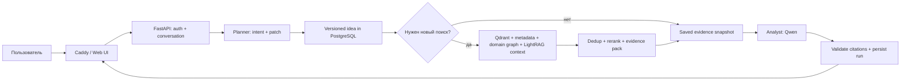
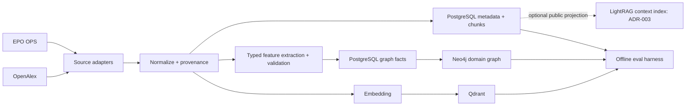

# Архитектура

## Цель и границы

Система помогает находить патенты и публикации, сравнивать их технические признаки с идеей пользователя и показывать проверяемые фрагменты первоисточников. Выводы ограничены найденным корпусом. Система не выносит юридическое заключение о патентной новизне.

Первое развёртывание: Ryzen 7 8845HS, 32 ГБ RAM, без дискретной GPU, Docker Compose на одном ПК. Клиенты открывают адаптивный интерфейс по LAN. Позднее HTTPS и отдельный GPU-сервер подключаются без изменения бизнес-логики.

## Границы компонентов

| Компонент | Ответственность | Хранилище / интерфейс |
|---|---|---|
| Web UI | Чат, источники, статусы, объясняющий подграф | React + TypeScript + Vite; статическая сборка |
| Caddy | HTTPS, единая точка входа, проксирование /api | Только внешний порт |
| FastAPI | Auth, ownership, API, orchestration, SSE | PostgreSQL через репозитории |
| Ingestion worker | Адаптеры EPO/OpenAlex, нормализация, индексация | Очередь задач в PostgreSQL; внутренние сервисы |
| Planner | Intent и валидированный patch идеи | Small LLM через InferenceProvider |
| Retrieval service | Параллельные кандидаты, дедупликация, rerank, evidence packing | Qdrant, PostgreSQL, Neo4j, LightRAG adapter |
| LightRAG adapter | Контекстный поиск по разрешённым публичным документам | Отдельный namespace в Neo4j/Qdrant; только context API |
| Domain graph | Типизированные связи документов и признаков | Neo4j с контролируемой онтологией |
| Analyst | Сравнение и ответ с цитатами | Smart Qwen через InferenceProvider |
| PostgreSQL | Истина для пользователей, идей, версий, запусков, источников | Транзакции, outbox, job state |
| Redis | Горячий кеш и rate limiting | Восстанавливаемые значения, не источник истины |

Один кодовый backend организован как модульный монолит. Ingestion worker запускает тот же пакет с другой командой. Внешние EPO/OpenAlex и inference подключаются только через интерфейсы. Не принимать произвольные Cypher-запросы или retrieval mode от браузера.

## Online flow

Planner предлагает patch, deterministic shell проверяет ссылки на существующие feature IDs, применяет его с optimistic concurrency и решает, можно ли переиспользовать evidence. Изменение смыслового признака, настроек retrieval или версии индекса для нового анализа запускает новый поиск. Объяснение уже найденного источника с явным source_run_id использует сохранённые evidence snapshot и idea_version исходного run даже после смены индекса; текущую идею conversation оно не изменяет. Каждый run сохраняет immutable входы, версии моделей и ссылки на фрагменты.

## Offline flow

Идемпотентность: source + external ID + source revision/content hash. Обновление создаёт immutable content revision и outbox-событие. Для активации обязательны ACK Qdrant и доменного Neo4j по той же revision и версиям indexer/extractor; optional LightRAG не входит в этот барьер. Проверенные graph facts сначала сохраняются в PostgreSQL. После ACK одной транзакцией публикуются новый index generation и active revision. При частичном сбое предыдущая generation остаётся доступной; retrieval фиксирует generation и перепроверяет membership кандидатов в PostgreSQL. Подробности — [DATA_MODEL](DATA_MODEL.md).

ING-001 проверяет барьер на fake index ports. IDX-001/GRAPH-001 подключают реальные consumers; GRAPH-001 закрывает сквозной gate активации обоих индексов. Это порядок разработки, не циклическая зависимость задач. Прямой custom KG LightRAG не переносит доменный provenance: его публичная проекция даёт только кандидатов, которые повторно разрешаются в нашем evidence store (ADR-003).

## Поиск и граф

Ограниченный первый пул: до 50 кандидатов из каждого доступного канала, затем дедуп по canonical source ID, гибридная нормализация и CPU-friendly rerank до 10–15 документов. Числа конфигурируются и уточняются оценкой. В Smart LLM идут только релевантные claims/abstract/snippets с лимитом токенов и стабильными evidence IDs. LightRAG запускается с `only_need_context`, не формирует пользовательский ответ; его внутренние сущности не считаются типизированным доменным графом. Для MVP адаптер может быть отключён при недоступности локальной модели извлечения, сохраняя базовый retrieval.

Граф интерфейса — производный подграф анализа, а не прямой доступ к Neo4j: идея, выбранные признаки, top документы и подтверждённые связи. Первый ответ ограничен примерно 30 узлами / 50 рёбрами. Раскрытие соседей постраничное, с проверкой ownership и лимитами.

## Исполнение и сбои

Очередь analysis jobs в PostgreSQL, один worker с общим лимитом генерации на CPU. API отдаёт `202` и SSE по `run_id`; приём запроса, idempotency и lease fencing описаны в [DATA_MODEL](DATA_MODEL.md), HTTP и replay — в [API_CONTRACTS](API_CONTRACTS.md). Отмена проверяется между этапами и перед terminal commit. InferenceProvider имеет `complete_json`, `stream_text`, `embed`, `rerank`; stream_text доступен внутренним потребителям, сырой поток модели клиенту не передаётся.

Единый run status: `pending`, `running`, `completed`, `failed`, `cancelled`. Сбой источника отражается в coverage. Невалидный draft допускает одну repair-попытку; timeout/ошибка генератора ведёт к проверенному deterministic fallback. Сохранённый fallback или сообщение о пустом evidence завершает run как `completed` с явным outcome; `failed` означает, что безопасный результат не удалось проверить/сохранить, либо обязательный этап не выполним. Citation validator проверяет структуру ссылок и буквальные spans, а смысловую достоверность оценивает отдельный offline review. Terminal answer и события публикуются атомарно после валидации, поэтому непроверенный текст не виден ни в GET, ни в SSE.

## Наблюдаемость

Структурированные логи: request/run ID, псевдонимный user ID, stage, latency, TTFT, token counts, cache hit, document IDs, retry/error code. Минимальные health и redaction появляются в SKEL/INFRA/API; OBS-001 добавляет метрики и retention. `/health/live` проверяет процесс; `/health/ready` — PostgreSQL, schema version, приём durable jobs и свежий worker heartbeat (503 при отказе). Qdrant/Neo4j/inference отражаются отдельно как capabilities; готовность очереди не обещает успешный анализ. INFRA проверяет bootstrap profile до реальных весов, LLM-002 — отдельный CPU gate. Полный пользовательский текст не логируется.
